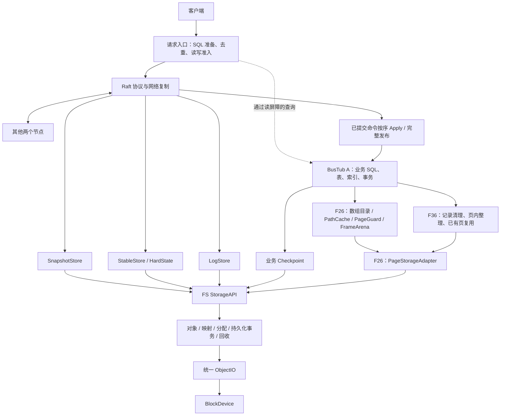
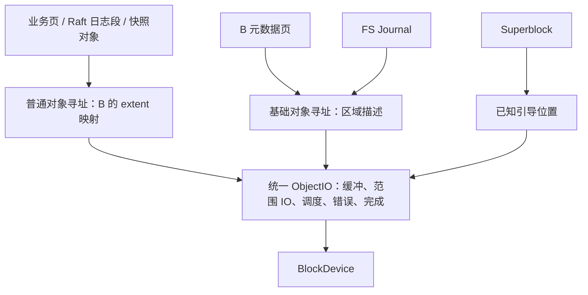

# 本地对象存储重构主方案：Raft / BusTub / FS / ObjectIO

更新时间：2026-09-26（Asia/Shanghai）

## 0. 当前状态、文档入口与工作顺序

本文件收录截至 2026-09-26 对话形成的目标架构与实施约束，包含统一 ObjectIO、减少重复持久化、查询链复用、数组式 BufferPool、页 IO 并发、A 层空间复用、Journal 跨段记录与安全复用、模块分工、实现顺序和待定项。各子模块的具体接口、格式、参数与测试仍需逐个冻结；本次收录不表示生产实现已完成。

- 当前成果：主方案、子模块文档入口和分阶段实现 prompt 已建立；S0 及 F01–F07 各自已获授权的当轮范围已执行，完成边界见下文；F06/F07 S3 当轮已完成；F05/S4 与 F08、F09 及本轮 F10/F11 B 恢复组件范围已完成；S5 其余部分及后续模块仍逐个讨论。
- 当前实现状态：S0/F00 已完成，见 [S0 执行记录](s0_execution_20260921.md)；S1/F01 当轮 Linux 文件后端与约定验证已完成，见 [F01 执行与测试审查](f01_execution_20260922.md)。S1/F02 有界执行器及约定验证已完成，见 [F02 执行与测试审查](f02_execution_20260922.md)。S2/F03 基础引导与异步修复、F04 固定区域寻址已完成，见 [F03](f03_execution_20260923.md) 和 [F04](f04_execution_20260923.md)。F05/S2 页后端已完成，见 [F05](f05_execution_20260923.md)；F06/S2 固定段后端已完成，见 [F06](f06_execution_20260924.md)。F01 裸设备、F02 普通对象/业务接入、节点统一支持、F06/S5 与后续阶段仍未完成；S3 见 [执行与八项审查](f07_execution_20260924.md)。S4 实际完成范围见 [F08 执行与八项审查](f08_execution_20260925.md)；F09 实际页写回已完成，见 [F09](f09_execution_20260926.md)，本轮 [F10/F11 B checkpoint 恢复](f10_execution_20260926.md) 已完成，日志裁剪/复用仍未完成。既有同名代码和历史 Raft 里程碑，不等于已满足本方案。
- 本轮 T0 执行与归档已结束：C1–C5 的 10 个参数点通过；P1/P2/P4 已测量并核对业务结果，P2 的超时和重试如实保留；P3 一小时完成 8,421/200,000 次操作，未完成完整轮次，不能作为 GC 空间稳定性基线。见 [最新运行记录](testing_execution_20260921.md) 和 [归档入口](../../test-results/storage-performance-v2-20260920T143546Z/README.md)。历史资格失败保留为诊断证据，不代替后续正式观测。
- 数组方案进度：Calico 核心机制已纳入 [F26 数组子方案](modules/array-buffer-pool.md)。[F02 外部缓冲许可](modules/object-io.md#f02-external-buffers)已获授权并完成独立组件实现与验证；真实 FrameArena/BufferPool 接入仍待 S9.1，不因此自动跳过 S2–S8。P3 未覆盖的长期稳定性继续如实留项。
- 第二轮评审方向已获用户“执行方案”授权；S0 当轮按 [F00 §6.13](modules/storage-contracts.md#613-s0-当轮实施范围用户授权后落定) 完成契约、最小范围类型和验证，其他阶段接口/格式仍逐个讨论。
- 子模块入口见第 14 节。所有模块有独立 Markdown 文件，模板见 [module_template.md](module_template.md)。
- 文档写入不授权自动实现代码、编写或运行未讨论的测试，也不授权自动推进后续模块。
- 论文讨论的逐项覆盖、当前代码兼容及待定边界见 [F26 对话覆盖审查](modules/array-buffer-pool.md#coverage-audit)。
- 仅引用已经审查、按约定执行的共同负载观测；未覆盖能力不推定通过。新模块的风险、接口及必要验收仍随子方案讨论。
- 既往改进审查见 [2026-09-21 方案审查](design_review_20260921.md)；2026-09-23 Journal 讨论覆盖及阶段纠偏见 §13.3、F06/F07。该轮仅更新方案；2026-09-24 用户已另行授权并完成 F06/S2，见当轮执行记录。
- S0 测试对照总方案的修正、保留/清理及提交前验证见 [测试复审](s0_test_review_20260921.md)。本地压缩证据与 Git 摘要的边界见 [归档入口](../../test-results/README.md)。
- 测试的已定实施约束见 [总体测试设计](testing_plan.md)；场景、预期、故障和资源的候选表见 [测试场景建议](testing_scenarios.md)。候选参数不表示已经批准执行。
- 每次新增或修改测试后，必须执行 [§1.5 测试设计审查](#15-每次新增或修改测试后的强制设计审查)。这项要求适用于现有和新建子模块及其实现 prompt；历史审查或运行通过不能替代当前改动的审查。
- 测试常驻、阶段归档和跨模块接入按 [§1.6](#16-测试演进跨模块复用与阶段退出) 执行：长期主线是共同生产 E2E 正确性／性能套件。F00、T0、F01–F06 的阶段性小测试已改为[按模块压缩归档](../../test/archives/README.md)，不再由默认入口发现；归档不代表其风险已全部被 E2E 接管。

历史契约阅读入口：[Raft 实施方案](../../raft_implementation_plan.md)、[执行交接](../../raft_execution_handoff.md)、[现有测试矩阵](../testing/raft_test_matrix.md)。这些文件用于了解已有正式路径、协议和历史证据。本方案的 S0–S13 是 FS 新阶段，不是历史 Raft M0–M8 的重新编号；本轮新方向不自动扩大未分配的实现任务，也不借历史验收为新代码背书。

F10/F11 第二次复审：生产实现未变；补足跨 checkpoint 同一页槽复用判据，修正 F10/F11 prompt 和测试段的阶段残留。6 项集成、26 项原回归重新通过，9 个既有定向变异均被检出，旧模块包已替换。见 [复审记录 §11](f10_execution_20260926.md#11-第二次复审2026-09-26)。

第三次复审完成代码逻辑与归档版本核验，未发现新问题，生产和测试未改，未重复运行 §11 已通过的测试。见 [复审记录 §12](f10_execution_20260926.md#12-第三次复审2026-09-26逻辑与归档核验)。

## 1. 所有主方案、子方案与实现 prompt 必须遵守的要求

> 代码要考虑复用性，间接性，安全性，不要破坏别的模块和层次的production级代码。

> 当本次任务接续上一次任务后，需要在完成前检查之前的代码是否因为当前改动有冗余的地方，有的话可以删除，也要检查是否有根本没用到的接口或函数之类的，也需要删除。

> 测试应该保护“这个项目自己承诺的行为和风险边界”，而不是给每一层实现细节、第三方库行为和历史重构痕迹都建立一套测试。

落实要求：

- 先检查已有可复用接口、调用者和数据归属，通过明确接口隔离层次；正式代码不得反向依赖测试辅助设施。
- 清理范围是本次改动及其引起的旧路径冗余。检查虚函数、模板、注册入口和对外契约，确认无用后删除声明、实现和相关引用；不能仅因单次文本搜索没有调用就删除生产接口。
- 保留仍被现有正式路径依赖的行为，不覆盖或清理用户已有的未提交改动。
- 对每项新增、保留、修改或删除的测试，说明它保护的项目承诺或风险及验证它的边界；避免重复覆盖和自证式断言。
- 完成前报告清理结果、受影响契约与验证证据；没有可删项时记录检查范围及原因。

### 1.1 未写明的部分如何处理

> 当遇到方案中未提到的部分时，先不要自作主张去写,而是汇报当前遇到的问题（注意先不要堆砌专有词汇，用我能看的懂的话去讲当前情况，有需要时再用专有词汇）。

这条要求适用于接口、磁盘格式、兼容、失败语义、算法和测试边界等未定部分。先说明实际卡点和影响，再补必要术语。不能把猜测写成已讨论结论；与当前缺项无关且已经授权的工作可以继续。

### 1.2 子模块文档的维护方式

每个模块沿用 [prompt_1.md](../../prompt_1.md) 的组织方式：背景、目标、本阶段只做/不做、方案、失败边界、阅读/修改位置、测试、验收与输出要求。

1. 进入模块时先读主方案、该模块文件、总体测试设计及依赖模块的实际阶段状态。
2. 将讨论决定写入“讨论后的方案”，说明接口、资源和数据归属、正常/失败/恢复路径、已定与未定部分。
3. 开源参考必须同时写出来源链接、借鉴机制、原项目解决的问题、本项目的具体落点及差异。主文档列过来源，不免除子模块再次说明的责任。
4. 将通用 prompt 更新为该模块当轮可执行 prompt；未讨论部分保持待定，不能默认为可实现。
5. 校对时先按 §1.7 分析代码逻辑，再决定必要的测试补充与运行；每次新增或修改测试后按 §1.5 完成设计审查。实现后检查受影响旧代码的冗余、未用接口/函数和失去意义的测试，确认无用后清理。
6. 同步模块介绍、阶段表、主方案目录与完成证据。不得因建立文件、通过编译或完成部分阶段就标记整个模块完成。

### 1.3 “已完成”的含义与写法

模块完成须有：当轮约定范围的实现、约定验证的证据、受影响行为检查、冗余/未用接口清理记录及剩余限制说明。涉及测试新增或修改时，还须有 §1.5 要求的测试设计审查及问题处理记录；测试运行通过不能替代设计审查。

完成后在对应模块“模块介绍与状态”的介绍文字下单独写 **“已完成”**，补上日期、代码版本、验证和清理证据；主表同步标记。跨阶段模块先更新该阶段行，完整约定范围未完成前，模块总体仍标“未完成”。

### 1.4 改造前后测试的实施约束

以下约束适用于全部子模块及其实现 prompt，详细定义和参考来源集中在 [testing_plan.md](testing_plan.md)：

1. 先审查测试内容和实现，建立旧系统基线，再做存储改造；改造后用同一套内容复测。测试内容层、测试适配层、生产层单向依赖；新旧差异收敛到测试侧适配器，不能通过适配器增加持久化、改变重试或补做业务功能。
2. 正确性验收覆盖真实客户端、三节点 Raft、BusTub、存储后端及恢复链路。输入必须有效、非空且实际产生预期读写，结果由独立预期或历史模型核对，不能只检查成功状态或进程存活。
3. 测试不得为方便自身而修改生产 API、默认路径、默认语义或增加测试专用分支。可使用已有正式配置、协议和外部进程/网络控制；能力不足时报告观察限制。架构需要的正式接口变更须在对应模块方案中另行讨论。
4. 每项性能场景有独立评价目标，同一次运行采集多项指标；不为每层重复建镜像测试。无关性能任务不能同时争抢资源；场景内计划好的并发、后台活动和事先约定的统计重复不属于重复建设。
5. 比较必须固定内容版本、数据、完成语义、重试、计时及资源口径。更换机器后重新测旧版；总内存包含相关缓存与工作缓冲，不能只对齐 BufferPool。
6. 进程终止、虚拟机重启和掉电模型分别记录。WSL/文件模拟、真实块设备和跨主机部署的结论分开；不以进程重启证明掉电安全，不以本机三个进程证明独立故障域。
7. 当前共同负载配置、次数和观察时限以已审查的 T0 文档与运行记录为准；后续新增能力、故障模型或验收门槛仍需讨论。保留原始 `t+`、未知结果及 P3 未覆盖项；文档更新不表示生产模块已完成。

### 1.5 每次新增或修改测试后的强制设计审查

本节落实 2026-09-22 用户要求：每次写完测试，都必须检查它保护什么、能否发现相应错误、是否重复，以及是否为测试污染生产设计。审查目标是让读者快速判断测试价值，不是逐行解释代码，也不是以测试数量、覆盖率数字或“全部通过”替代判断。

#### 1.5.1 触发时机与范围

本节审查的是测试设计；开始校对时先执行 §1.7 的代码逻辑分析，不以先写回归测试替代原因判断。

- 每次新增或修改测试、测试数据生成器、适配器、历史模型、故障证据提取、测量或报告逻辑后，均须审查；生产修改使原测试的路径或判断依据发生变化时，也须复核受影响测试。
- 在本轮测试编写结束后、作为验收依据或提交本轮变更前完成审查。修正审查问题后，再检查受影响项；可以按一批相关变更组织报告，不要求每保存一行代码就重复全文。
- 明确比较的提交或工作区变更范围，区分新增、修改、删除和仅迁移的测试；仅迁移不计作新增覆盖。比较与本轮 invariant 有关的既有测试，不要求每次重审全仓库无关测试。
- 以下八项检查每次都要走一遍。小改动可以合并表述或引用仍适用的既有证据，但不得省略判断；不适用项说明原因，不只写“已检查”。本要求不改变已约定的实现、运行授权和资源范围。

#### 1.5.2 必须依次完成的八项检查

1. **测试全景。** 列出本轮所有新增或修改的测试，每项一行说明名称、验证的 invariant（必须成立的性质）、unit / integration / E2E 类型及是否属于 regression，以及它防止的具体 bug。无法说明防止什么 bug 时直接指出。性能测量说明独立评价目标、能够暴露的退化及是否存在自动判退门槛，不能把没有门槛的测量写成自动拦截性能回归。

2. **逐项说明“目标 → 输入 → 执行 → Oracle → 失败含义”。** 目标用性质描述；输入说明关键变量、选择理由、正常／边界／非法情况。列出实际经过的生产接口、实现及存储／网络路径，明确绕过了哪些正式路径。Oracle 即判断对错的依据，必须说明 expected 从哪里来、是否独立于被测实现、断言是否对应目标，以及实现与 oracle 是否可能一起出错。说明失败能定位到什么程度，区分业务错误、测试工具错误、检查未完成和环境限制。工具自检不能冒充数据库正确性证据。

3. **生产代码污染。** 单独列出因测试或伴随测试而修改的 production 代码，包括 public API、默认参数、getter、test-only hook、wrapper、pass-through function、配置项、内部状态暴露、`#ifdef TEST` 等分支及控制流变化。逐项回答：生产是否真正需要；删掉测试后是否仍值得存在；能否用已有接口完成；是否只是为了测试方便扩大接口。给出文件、函数和代码位置，没有相关改动也须明确说明。测试侧辅助设施与生产层改动分别判断，不能把真实缺陷修复一律当作污染。

4. **接口污染。** 进一步核对是否把显式参数改为默认值、内部函数改为 public、给封装状态增加 getter、增加只被测试使用的生产 API，或为测试修改 ABI / interface、引入没有生产价值的抽象。合理生产接口须给出真实调用者和职责；“方便测试”“以后也许会用到”不是充分理由。不得通过生产钩子或适配器补做业务、恢复、持久化来使测试通过。

5. **重复与低价值测试。** 比较本轮及相关既有测试，检查同一 invariant 的重复、unit / integration / E2E 是否已完整替代彼此、多组输入是否增加新的 failure mode（出错情形），以及是否只验证第三方／语言／标准库行为、私有步骤或历史重构痕迹。对疑似重复明确写出“A 和 B 重复验证什么”，决定保留哪项、合并或删除并说明依据。不能仅因测试多就认为覆盖更好。按 §1.6 区分常驻 E2E、开发期临时验证和压缩归档；某项风险仍有效不等于对应小测试必须长期常驻，退出时如实记录是否已有替代覆盖。

6. **发现错误的能力。** 对每个重要测试给出最小 mutation（故意改坏实现）示例，例如删检查、改比较符、漏状态更新、错地址偏移或漏计一段耗时。说明现有测试是否会失败、依赖什么触发条件，以及为何仍可能通过。发现负面测试对“始终拒绝”也通过，或 oracle 接受明显错误时，补必要正例、独立预期或路径验证；不要用大量类似参数代替缺失的判断。

7. **稳定性。** 检查执行顺序、全局／共享状态、cleanup、sleep、真实时间窗口、线程调度与 race、随机 seed、文件系统／网络／GPU 等环境依赖，以及断言是否绑定无关实现细节。具体指出可能 flaky 的位置和原因。优先用测试侧确定性数据、时钟或同步关系表达逻辑，超时用于限制挂起；真实超时与性能本身是目标时保留真实计时并说明环境边界，不为此侵入生产。

8. **最终矩阵与结论。** 按下表汇总，建议只使用“保留、简化、合并、删除、需要补充”，并写出原因。最后分别总结：核心保护、低价值测试、重复测试、纯粹为测试引入的生产修改、仍缺少的重要 failure mode。结论引用具体文件、函数、测试名称及代码位置，不能只作抽象评价。

| Test | 验证 invariant | Oracle | 覆盖的新 failure mode | 与其他测试重复 | Production pollution | 建议 | 原因 |
| --- | --- | --- | --- | --- | --- | --- | --- |

#### 1.5.3 判断依据与证据要求

- **避免自证。** expected 优先来自人工小样本、明确格式、独立模型或输入推导，不调用被测实现生成答案后再与自身比较。复用生产编码或校验函数构造输入时，说明它只承担构造职责，并保留独立的格式／语义依据；Encode → Decode 往返不独自证明格式正确。
- **验证实际分支。** 测试输入必须进入当前生产／测量实际使用的路径。不能用旧报告格式、回退分支或脚本响应的通过结果，宣称当前路径已受保护。正常接受和正确拒绝应有必要的成对证据；补充的是不同错误模式，不是为了每个函数机械增加正反两个测试。
- **计算要能查错。** 有确定时钟和输入时，对累计耗时、次数、窗口归属和百分位使用可独立核对的 expected。诸如“延迟大于零”的宽松断言不能承担“包含排队、重试、发现和退避”的承诺。检查器未完成、结果未知、`t+`、尾部完成和未覆盖项必须如实保留。
- **区分分析与实测。** 静态推演、实际运行、实际 mutation 验证分别标记。重要测试每次都需考虑最小错误示例，但不要求每次运行全量 mutation 工具。需要实际验证疑点时，在已授权范围内使用隔离副本或安全的测试设施，记录修改、命令、结果和限制，清理临时变异；不得污染工作区或把局部变异结果宣传为全项目覆盖率。
- **覆盖结论不能越界。** “测试设计合理”“工具自检通过”“系统测试通过”“性能已测量”分别记录。进程 SIGKILL 不证明设备掉电安全，副本固定边界的内容读取不证明线性一致服务，空间周转不足不证明 GC 稳态，性能变慢但测量完成也不自动成为正确性失败。

#### 1.5.4 问题处理与完成记录

- 对仍作为本轮验收依据或常驻套件使用、会导致误判、漏掉关键风险或污染生产的已知问题，修正后复审并执行必要验证；尚未解决时明确列为待处理，不能以已有绿灯宣称对应设计已通过。阶段小测试可以按 §1.6 归档退出，同时保留缺口；归档不是修复证明，也不要求先补齐已退出测试的全部自检。
- 超出本轮承诺或当前环境能力的缺口明确记录为限制，不自行扩大阶段范围，也不要求为无关能力无限补测。涉及尚未讨论的正式接口、故障模型或验收标准，按 §1.1 汇报。
- 在对应模块或既有审查记录中保存范围、矩阵、问题处理、运行证据和剩余限制，并在交付回复中给出入口及关键结论。无需为每个测试新建文档，也不要求小改动复制整份长报告。
- 已有执行记录保留原始事实；后续发现设计缺口时追加适用边界和待处理项，不改写历史结果，不将之前的“通过”作为免审理由。

### 1.6 测试演进、跨模块复用与阶段退出

本节落实用户后续取舍：本次重构长期维护的测试以改造前建立的 **C1–C5 正确性、P1–P4 性能共同套件及其真实生产路径**为主。模块开发期间可以编写帮助定位的小测试，阶段验证后默认删除或按模块压缩归档，不把每层的小测试积累成长期验收体系。这里的“保留”须标明是常驻运行还是只保留归档；既有课程及历史 Raft 套件不因这条规则自动认定为新增 E2E，也不在本轮一并删除。

#### 1.6.1 区分手写预期、模拟执行和真实执行

| 内容 | 当前能证明什么 | 后续如何处理 |
| --- | --- | --- |
| 手写 expected、独立业务模型、历史合法性规则 | 提供判断依据，本身不等于模拟了数据库 | 真实 E2E 仍需要这些 oracle，不能因“手写”而删除实际使用的模型 |
| 真实客户端及节点执行的 C/P 场景 | 该版本、资源和故障条件下的业务结果与性能 | 作为长期主线保留，随生产版本接入同一内容 |
| 尚无生产能力时的脚本响应／内存后端场景 | 测试内容或调用约定能否工作，不证明数据库／设备兑现保证 | 标为模拟或待接入；能力就绪后用测试侧适配接入真实路径，重新运行并记录证据 |
| 生成器、重试、报告、历史模型的自检 | 测试工具自己的规则，不直接证明数据库行为 | 阶段验证后归档；它们不会仅因数据库完善就自动变成数据库 E2E，必要时按工具变更临时恢复复核 |
| 真实组件／单节点小回归 | 某个窄路径的行为，例如范围解码或单节点 SQL 恢复 | 不误称“假测试”，但按用户取舍退出常驻套件，保留风险映射和模块归档 |

从模拟转为生产，保留的是可复用的**业务输入、操作顺序、故障目标、独立 oracle 和完成语义**，不一定能原封不动保留原测试函数。组件私有调用不能只换类名就宣称 E2E；需通过已有正式客户端／存储入口触发该行为。缺少正式能力时记录“待接入／未覆盖”，不添加测试专用生产 API，不把模拟成功作为真实成功。

#### 1.6.2 跨模块兼容与唯一场景归属

- 每项待接入风险在所属模块“测试方案与验收”中登记稳定场景／风险标识、唯一内容维护者、相关模块、当前执行层级、所需正式能力、接入阶段、替代或关联场景、退出方式及实际证据。用文档表维护即可，不为此新增生产管理器或通用测试框架。
- 同一条端到端风险可以涉及 Raft、BusTub、ObjectIO、设备等多个模块；各模块引用同一场景及其证据，不各自复制输入、预期、计时和故障编排。模块实现就绪时先查已有场景，再改测试侧适配或补必要观测。
- 新旧后端映射必须保持已冻结的参数含义、错误分类、请求身份、排序、缓冲生命周期和完成语义；不能把 IO 完成翻译为 durable，也不能由适配器补做 flush、恢复或业务操作来掩盖生产缺口。
- 新旧对比继续固定内容版本、数据与 seed、资源、负载及重试／计时口径。新增能力和新故障场景单独标版本与支持范围，不回写旧基线，不把旧版“未支持／未覆盖”当作通过或与新版完整结果直接比较。
- 避免将同一共同场景的运行时长和结果重复计入多个模块成果。不同模块确需补临时验证时，说明尚未由共同场景覆盖的风险；接入后检查并移除失去独立价值的测试、适配和注册入口。

| 场景／风险标识 | 内容维护者／相关模块 | 当前真实路径或模拟边界 | 待接入能力／阶段 | 共同 E2E 关联及覆盖差异 | 退出方式／证据 |
| --- | --- | --- | --- | --- | --- |
| C1–C5、P1–P4 | T0；各存储、页 IO、恢复及 Raft 模块引用 | 已有正式三节点客户端、数据库和文件存储路径 | 各模块就绪后接入新生产实现，同内容复测 | 常驻共同套件；不按模块复制 | 持续维护；历史运行见 T0 执行记录 |
| F02/batch-barrier、budget、admission、failure-drain、flush-error、lifetime-close | F02；F31/F32/F26/F35 引用 | 真实 Linux Direct 文件及 F01/F02；确定性暂停和错误注入标明 | S2/S6 对象寻址，S8/S9 业务接入与节点统一预算 | C/P 尚未经过 F02；组件证明不替代 E2E | 当前共 8 项/10 个变异，含下方 external-buffer 风险，不重复计数；仅压缩归档；[审查](f02_execution_20260922.md#14-2026-09-23-方案落实与测试复审) |
| F09/canonical-pages、wal-before-page、version-writeback、failed-progress、close-drain | F09；F10/F11/F26 引用 | 正式 B→F05→F04→F02→F01 Direct 文件，独立解析最终页区；注入只在测试链接侧 | F10/F11 checkpoint/最终页恢复，后续业务 E2E | 不是物理掉电或性能；仍从全 Journal 恢复 | 4 项、原 F08 6 项、8 个变异；仅压缩；[审查](f09_execution_20260926.md) |
| F08/atomic-view、mixed-values、private-rollback、page-reuse、redo-base、reopen | F08；F09/F10/F11/F13/F26 引用 | 正式 B→F07→F06→F04→F02→F01 Direct 文件；暂停/EIO 为测试侧注入 | S5 最终页/checkpoint/回收，S6 对象，S8/S9 业务接入 | 不是物理掉电或三节点 E2E；S4 页全驻留 | 6 项/12 个变异，原 A 回归 12 项；仅最终压缩包；[八项审查](f08_execution_20260925.md) |
| F07/format-chain、group-durable、admission-lifetime、failure-isolation、reopen | F07；F08/F10/F11/F27 引用 | 正式 F07→F06→F04→F02→F01 Direct 文件；暂停/EIO 为链接侧注入 | S4 B WAL 已接入；S5 checkpoint/复用、S10 Deferred、真实节点 E2E 待完成 | 完整批次组件验证，不能替代数据库恢复或掉电实验 | 8 项/13 个变异，复用原 F02/F06 共 10 项；仅最终压缩包；[复审](f07_execution_20260924.md#10-2026-09-25-再次方案代码与测试复审) |
| F06/segment-address、segment-boundary、io-adaptation | F06；F07/F10/F11 引用 | 正式段后端→F04→F02→F01 Direct，独立整文件 oracle | S3 已由 F07 接续；S5 checkpoint/复用及业务接入仍待完成 | 原始字节 IO 不是事务恢复或 E2E | 2 项/7 个变异，原 F04 3 项回归；仅压缩归档；[审查](f06_execution_20260924.md) |
| F05/page-address、page-capacity、page-io-adaptation | F05；F08/F09/F26 引用 | 正式页后端→F04→F02→F01 Direct；强对齐为测试链接侧注入 | S4 分配/页格式、S5 WAL 约束写回、S9 帧/业务接入 | 无实际 B 事务与业务 E2E；不复制 F02/F04 全矩阵 | 2 项/6 个变异；复用 F04 原 3 项回归；仅压缩归档；[审查](f05_execution_20260923.md) |
| F04/region-binding、region-containment、io-adaptation | F04；F05/F06/F12/F34 引用 | 正式 F03→F04→F02→F01 Direct 文件，EIO 为测试侧注入 | F05/S2、F06/S2 已接入；Journal/S3 和 B/S4 已接入；节点业务待完成 | 不复制 F02 算法矩阵；F03 回归复用原包 | 3 项/6 个变异；仅压缩归档；[审查](f04_execution_20260923.md) |
| F03/bootstrap-format、create-durable、copy-selection、repair-lifecycle | F03；F02/F04/F10/F34 引用 | 真实 Direct 文件/F03→F02→F01；暂停/EIO/读回损坏为测试侧注入 | S2 区域后端/节点接入；S5 恢复根；裸设备/掉电待验证 | C/P 尚未经过新引导，不重复建立整套 F02 测试 | 8 项/11 个变异；仅压缩归档；[八项审查](f03_execution_20260923.md) |
| F01/range-io、reject-invalid、concurrent、durability、failure-boundary | F01；F02/F26/恢复模块引用 | Linux 真实文件 Direct；系统调用故障注入另行标记 | F02 已接入组件路径；S8/S9 业务接入、裸设备及掉电仍待验证 | C/P 尚未经过新后端；错误细节未等价接管 | 本轮按 F01 压缩归档；见 [执行记录](f01_execution_20260922.md)，缺口保留 |
| F26/translation-lifetime、translation-memory | F26；F08/F34/F36 引用 | 尚未实现；身份、页内容、回收及预算的独立判据待冻结 | S9.1 数组/帧真实路径，S9.2/S9.3 复用和释放 | 不能从课程测试或手写目录推定生产通过 | 仅方案；必要阶段验证按 F26 归档 |
| F02/external-buffer | F02；F26/F31/F32 引用 | 独立许可已实现；当前八项组件场景复用原风险并验证外部所有权/额度 | S9.1c 接入真实 FrameArena 和设备 IO | 尚未覆盖真实帧/页发布及 BufferPool 默认迁移 | 新版 F02 模块包替换旧版，8 项/10 个变异通过 |
| F00/range-boundary | F00；后续范围／ObjectIO 消费者引用 | 范围值类型及真实文件解码；非三节点 E2E | 相关生产入口就绪后评估从真实链路触发非法范围／损坏输入 | C4/C5 正常恢复不完整覆盖恶意长度与地址溢出 | 本轮小测试压缩归档，缺口保留，不能标已替代 |
| T0/sql-payload-recovery | T0；业务页和恢复模块引用 | 真实单节点 SQL、重放、快照 | 需要时在 C1/C4 内容中讨论等价边界验证 | 已有变长数据／重启覆盖；1025 字节拒绝和精确恢复边界未完整等价 | 本轮压缩归档，场景扩展另行冻结 |
| T0/harness-oracle | T0 测试工具维护者 | Python 脚本响应、报告样本、Go 人工历史自检 | 工具变化时按需临时复核；不自动升级为数据库 E2E | C/P 继续使用实际模型／驱动／报告；自检与真实业务证据分开 | 本轮压缩归档，保留已知 oracle 缺口 |

#### 1.6.3 接入、归并与退出流程

```text
登记风险和共同场景
  → 生产未支持：必要临时验证，明确模拟／组件边界
  → 生产支持：复用内容，通过测试侧适配接入正式路径
  → 按 §1.5 审查并进行约定的真实运行，核对有效工作和故障确实发生
  → 比较旧小测试的 invariant、输入边界、故障及 oracle 是否已被接管
  → 归并到共同套件；阶段小测试删除或按模块压缩，移除常驻入口
```

用户可选择在完整 E2E 接管前归档阶段测试，本轮即采用此方式。必须记录尚未接管的风险，不能以“有 C4/C5”就写成已覆盖所有恢复边界；真实 IO 不等于真实掉电，运行在物理机器上也不自动扩大故障保证。

#### 1.6.4 归档与常驻目录

- 常驻目录保留共同 C/P 场景及实际执行所需的内容模型、客户端驱动、适配、故障控制、历史检查器和报告工具。**工具本身和测试工具的自检是两回事**；归档后者不能破坏前者。
- 开发期小测试按模块压缩为 `test/archives/<模块名>.tar.gz`，附源提交、原路径、文件哈希、依赖／恢复方式、历史结果入口、未覆盖风险及已知问题。核验可解压且源码字节一致后移除工作副本和无用注册；不把构建、缓存和节点数据放进源码包。
- 小型测试源码归档随仓库保存；大型运行证据继续沿用 `test-results/` 的本地压缩规则。归档不进入 CTest、Python／Go 日常发现或性能统计，恢复时解压到仓库外的隔离目录，按对应版本依赖运行；不得默认永久恢复全部小测试。
- 每次阶段结束按 §1.5 输出矩阵并补“常驻／归档／删除、替代场景、剩余缺口”，不以增加测试数量作为完成目标。本轮归档清单及校验、恢复说明见 [test/archives](../../test/archives/README.md)。

#### 1.6.5 单个模块的测试交付约定

每个模块按以下顺序安排测试，不以建立一套长期维护的模块单元测试作为默认交付：

1. **开始实现前**：先说明本模块的生产行为由哪些共同 E2E／性能场景验证，哪些风险尚未覆盖；复用已有内容与工具，不因为增加一个模块就复制一套场景。
2. **开发过程中**：校对先按 §1.7 推演代码逻辑，确认原因和处理方式；随后只为当轮功能和真实风险编写必要的临时小测试。生产能力尚未具备时，可以使用手写输入、脚本响应或模拟后端，但须说明实际验证边界和后续真实接入条件，不能把这种通过算作完整生产验收。
3. **写完测试后**：执行 §1.5 的八项设计审查和当轮约定验证；记录可复查的结果与限制。没有覆盖的能力明确留项，不用增加细枝末节的断言代替真实链路验证。
4. **模块收尾时**：阶段小测试默认从常驻测试树退出，删除或按模块名压缩保存，清除相应注册和临时产物；需要留存时保存源码、版本、哈希、恢复方式及证据，而不是默认永久运行。常驻共同套件实际使用的模型、驱动和报告工具继续保留。
5. **后续模块接入时**：复用相同输入、独立预期和完成语义，通过测试侧适配运行真实生产路径；核对跨模块兼容和重复覆盖，再将必要行为归并到共同 E2E／性能套件。旧小测试没有被等价接管的风险仍记录为缺口，归档本身不证明问题已解决。

因此，单模块的测试交付是“必要阶段验证＋审查和证据＋真实场景接入／缺口记录＋退出清理”；项目长期测试的重点是完整生产系统的正确性和性能。

### 1.7 控制防御性代码，先分析逻辑再验证

本节落实 2026-09-25 用户补充，适用于所有现有／新增子模块、实现 prompt 和后续复审：

> 不要过多纠结于边界条件和防御性编程，防止可能出现的问题被掩盖。

> 校对和检验时，不要一开始就通过编写回归测试的方式来检验，先从代码逻辑上来分析，确认没问题再写测试。

1. **围绕已承诺的行为写代码。** 优先把正常路径、状态转换、数据和资源归属写清楚；不为未经证实的假设层层增加分支、配置、包装或兼容路径。发现实际问题先修原因，不以默认值、静默降级、吞异常、无依据重试或自动修复让错误看起来消失。
2. **保留必要检查，不机械堆叠。** 外部输入、磁盘格式、内存／地址范围、持久化顺序和资源生命周期的必要检查仍应保留；它们保护本项目已承诺的安全边界。“少做防御性编程”不表示接受损坏数据或删除必要校验。内部已经成立的条件无需逐层重复检查；若违反约定，应按既有错误契约明确暴露，保留原始错误。
3. **复审先读代码。** 先对照方案沿调用链推演正常、失败、并发、恢复及资源释放，指出问题的触发条件、原因、影响和责任位置。不能一开始就加回归测试、再凭绿灯反推设计正确；不能在原因未明时靠增加保护分支试到测试通过。
4. **分析后再做必要验证。** 发现缺陷先明确修法并复核修正后的逻辑；没有发现缺陷也说明检查范围及限制。随后检查现有场景和独立判据，确有未覆盖的项目风险时才编写或修改测试，并运行与改动相称的验证。未改实现／测试且没有新疑点时可复用经版本和哈希核实的证据，不机械补测或重复跑全套。
5. **区分证据。** 逻辑分析不是形式化正确性证明，也不取代已有约定的验收测试；不改变先讨论测试设计、改造前后同内容复测的既定顺序；“本轮分析结论”“本轮实测”“历史结果复核”分别记录。新增／修改测试后仍执行 §1.5 八项审查和 §1.6 归档、兼容及去重要求。未讨论的语义按 §1.1 汇报，不通过防御性默认策略自行决定。

## 2. 目标与集群边界

目标是保留当前三节点 Raft 和业务 SQL，让每个节点的本地 FS 接管对象、空间、持久化、恢复和设备 IO：

- Raft：复制历史、成员/角色、提交顺序、跨节点追赶和恢复。
- BusTub A：业务 SQL、Catalog、表、索引、事务、业务可见性及页缓存。
- 本地 FS：对象、映射、分配、提交、IO、回收与本地恢复。
- MetadataEngine B：复用 BusTub 存储组件，管理 FS 元数据。
- ObjectIO：普通数据、Raft log、snapshot、FS Journal、元数据和引导内容的统一对象范围 IO。
- BlockDevice：裸设备访问及持久化屏障；开发可提供真实文件后端。**新 F01 默认 O_DIRECT，Buffered 必须显式选择，不自动降级。Direct 的内存、偏移和长度约束从已打开后端查询，不能统一假定为 4 KiB，也不能用页大小或 st_blksize 代替。** 查询不到可靠能力则明确失败。IO 完成、持久化和原子性分别表达；文件 Direct 验证不等于裸设备/掉电验证。F02/F26 负责满足缓冲与写入规划约束，F01 不隐藏复制或 RMW。

FS 的范围是节点内。PG、Pool、MON、CRUSH 及独立存储复制协议属于另一个架构方向，不属于本轮依赖。当前没有为三个静态节点再新增多套独立 Raft 分片。

这里“对象”是可寻址的数据容器，OSD 在 Ceph 中是承担存储服务的守护进程，不能把对象改名为 OSD。副本 Pool 的部分目标由本项目 Raft 的复制、多数派提交和追赶承担，但 Pool 的放置、故障域、EC 编码等职责并未因此全部实现。增量日志追赶与快照安装分别承担增量/完整恢复起点的作用，不引入 Ceph PG 的 peering、recovery、backfill 协议或 MON/OSDMap。节点本地物理损坏仍须被 FS 检出并上报，Raft 不是任意坏块的自动修复器；相关比较与取舍见 [第二轮审查](design_review_20260921.md#7-第二轮复核与补充)。

对照 [Ceph 存储集群](https://docs.ceph.com/en/latest/architecture/storage-cluster/)、[Pool/放置职责](https://docs.ceph.com/en/latest/architecture/dynamic-cluster-management/) 和 [PG 状态](https://docs.ceph.com/en/latest/rados/operations/pg-states/)：本项目采用本地对象间接寻址及分阶段恢复的组织思路，跨节点权威继续由已有 Raft 保持，不将上述对照写成已实现独立存储集群。

```text
                      客户端
                         │
                    当前 Leader
                         │
         ┌───────────────┼───────────────┐
         │               │               │
       节点 1          节点 2          节点 3
         Raft ←────── Raft 复制协议 ────→ Raft
         │               │               │
      BusTub A        BusTub A        BusTub A
         │               │               │
       本地 FS         本地 FS         本地 FS
         │               │               │
       本地设备        本地设备        本地设备
```

希望改善：重复缓存与复制、设备 IO 控制、完成语义、IO 并发和空间回收。裸设备、COW、Journal 和 GC 各有成本，性能收益应在相同持久化/一致性保证下验证，不能从架构名称推定。

## 3. 单节点总体架构



业务路径：Raft → Apply → A → 页适配 → FS。Raft 自身的 LogStore、StableStore、SnapshotStore 另有直接进入 FS 的持久化路径。

节点的状态控制、资源预算与恢复编排是横切职责；它们不要求每次普通 IO 同步往返全局控制器。F35 负责协议事件与请求阶段推进；F26 管页生命周期，F36 判断记录/页能否回收。三者不合并成一个全局事务或 GC 决策器。

## 4. 对象模型与统一 ObjectIO

### 4.1 对象归属

| 持久化内容 | 对象归属 | 寻址方式 |
| --- | --- | --- |
| A 的表页、索引页 | 普通数据库页容器对象 | B 的 extent 映射 |
| Raft entry 正文 | 普通日志段对象 | B 的 extent 映射 |
| 快照正文 | 普通不可变快照对象 | B 的 extent 映射 |
| HardState、Manifest | B 中的小控制记录，位于元数据对象 | 基础元数据寻址 |
| B 元数据页 | 基础元数据对象 | 设备区域描述 |
| FS Journal | 基础 Journal 对象/段 | 设备区域描述 |
| Superblock | 已知位置的引导对象 | 约定引导位置 |

extent 表示一段连续设备范围，如“设备 D、起点 X、长度 L”。对象逻辑上连续，物理上可以由多个 extent 组成。

连续分配是 F12 的择优目标，不是追加/读取的正确性前提。多个页打包到一个对象不保证物理相邻，也不自动减少要访问的逻辑页数；随机点查不默认扩大预读。A 的页内空闲摘要描述“页里还能放多少记录”，FS bitmap 描述“设备哪些范围可分配”，两者不能混为一张分配表。



### 4.2 ObjectIO 的边界

统一：请求表达、地址适配、缓冲生命周期、对齐、拆分合并、有界调度、错误结果和完成通知。普通读使用固定的已发布映射；Common 新写使用事务内预留映射。

普通对象、元数据、Journal 保留不同持久化协议。ObjectIO 执行满足前置依赖的 IO，不把 Journal 写入再次包成 Deferred。统一执行层可以有多队列、多工作线程和不同资源预算。

HardState 不必独占一个物理对象；作为 B 的小记录仍能通过元数据对象统一 IO。若将来需要对外也表现为内联对象，应在相应子方案讨论。

## 5. FS 内部职责与上下游

### 5.1 请求与对象接口

```text
StorageAPI
├── ObjectAPI：创建、读写、追加、截断、删除
├── ControlKV：少量控制记录
└── TransactionAPI：对象、控制记录及引用的原子组合
```

| 组件 | 职责 |
| --- | --- |
| Admission | 先预留数据、元数据、Journal、内存和在途 IO 资源 |
| Sequencer | 排序冲突范围及追加/截断/删除依赖，考虑实际 RMW 物理范围 |
| WritePlanner | 拆分请求，规划读旧数据、分配、校验与 Common/Deferred 路径 |
| CommitPipeline / TxContext | 薄协调器记录依赖和完成状态，装配批次；不亲自实现所有步骤 |
| VersionPublisher | 发布完整元数据/对象版本及读取来源 |
| ReadResolver | 根据可见版本生成读取计划 |

### 5.2 元数据与空间

B 管理对象属性、映射、分配事实、持久引用和控制记录。Allocator 管理普通数据空间。MetadataBackend 管理可直接寻址的元数据页区域；两者职责按地址空间区分，不能重复维护同一分配事实。

A 的业务页适配采用确定性分组方向；B 的元数据页保持 F05 基础区域寻址，不使用下式重新查询自身的普通对象映射：

```text
object_id = (数据库身份, page_id / K)
offset    = (page_id % K) × page_size
```

K 尚未确定。这允许避免持久化一张可计算的 page→object 重复表。B 持久化对象逻辑范围→extent 的真正映射。

“数据库身份”必须区分 A/B 及业务工作库的重建代次。当前恢复/快照安装会建立新工作库，页号可能重新从低位分配；新工作库不能误用旧对象、旧帧或旧 IO 回调。对象代次、内容版本、帧代次和 Journal 段代次各有作用，不能共用一个含义不明的 generation。

分层 bitmap：L0 保存基础分配事实，L1 以上提供全空闲/部分空闲/无空闲等搜索摘要。高层摘要尽量重建；预留与提交分开；坏块/隔离另行表达。连续空闲长度等查找信息待子方案确定。

### 5.3 持久化子系统

```text
DurabilityService（组织边界，不是额外一套日志）
├── CommitPipeline
├── JournalService
├── RecoveryDispatcher
└── 与引用、checkpoint、GC 的保留协议
```

B 提供元数据恢复记录；JournalService 统一负责 WAL/Journal 的实际记录与刷盘。RecoveryDispatcher 按类型把元数据恢复交给 B，把 Deferred 恢复交给读取/写回路径。

共享 [F00 完成契约](modules/storage-contracts.md#67-完成是几项事实不是一条通用枚举流水线)：缓冲归还、字节 IO 完成、本地事务 durable、本地版本发布、Raft 提交/应用分别确认。F00 是类型与约定，不增一层运行服务。默认本地事务成功具备 durable 和发布，设备字节 IO 的完成不提供同等保证；旧同步 Store 契约在 S8 保留，异步协议推进归 S13。

参考 [Ceph SeaStore](https://docs.ceph.com/en/latest/dev/crimson/seastore/) 的事务接口协调职责，用于本项目提交、日志和映射的分工；本项目继续以 B 作为元数据引擎，不照搬其完整后端和线程模型。

### 5.4 数据路径与后台工作

普通数据由写入规划得到 IO 计划，经普通对象 IO 适配、ObjectIO 访问 BlockDevice。正文不必进入 B 的普通 value 或页缓存。

ReadResolver 输出：

- 已落位范围 → 对应数据 extent。
- 尚未落位范围 → Journal 的 PayloadRef。
- 已有受保护缓冲 → 相应版本缓冲。

后台模块包括 MetadataPageWriter、B CheckpointManager、DeferredWriteback、GCService、日志段整理和校验扫描。它们共用预算并独立报告完成事件。

## 6. 持久化内容归属与去重边界

| 内容 | 正文归属 | 其他模块保存什么 |
| --- | --- | --- |
| Raft entry | 最终日志段对象 | 段位置/偏移/有效范围 |
| 快照正文 | 不可变对象 | 发布清单引用 |
| 普通业务数据 | 数据 extent | 对象映射和版本引用 |
| Deferred 正文 | Journal 记录 | PayloadRef、必要任务描述 |
| B 元数据状态 | 元数据对象 | Journal 中必要的恢复记录 |

```text
CommitBatch
├── B 元数据恢复信息
├── 控制记录变化
├── 引用建立 / 解除
├── Common 数据 durable 依赖
└── 可选 Deferred 描述与正文
```

- B WAL 与 FS Journal 共用恢复基础，不各自写一套元数据日志。
- Common 正文先写数据区域，Journal 记录必要元数据，不再复制正文。
- Deferred 的读路径、恢复与写回共用一份 Journal 正文；目录不存第二份大 value。
- Snapshot 发布通过清单引用，避免临时正文再复制到正式正文。
- 可重建索引、位图摘要、运行状态不默认独立持久化。
- 一批次是原子边界；多个批次可 group commit。LSN 递增不等于 IO 已连续 durable，不能跳过未完成空洞。
- 批次身份和日志位置表达不同概念，不要求必有两套持久化计数器；能由提交记录位置唯一识别批次时可复用表示，但恢复仍须知道批次范围和完整性。对不存在依赖的请求不强加全局发布顺序。
- ObjectRef / PayloadRef 需表达身份、代次、范围及完整性。持久引用变化须原子提交；临时读者和 IO 也要保护内容。
- Raft log 与 Journal 分段管理生命周期，避免长期日志拖住短周期恢复记录。

参考 [RocksDB BlobDB](https://rocksdb.org/blog/2021/05/26/integrated-blob-db.html) 的大值与索引分离，用于 B 只保存正文引用的分工；它并不承诺所有内容只写一次，本项目也不将此等同于全盘内容哈希去重。

必要的多份内容仍包括 Journal→最终位置交接、COW 旧版本、快照引用、完整页映像及三节点容错副本。Raft 命令和执行后的数据库页通常是不同表示，不能仅凭“业务内容相同”直接合并。

### 6.1 原子提交不是合并系统调用（2026-09-23）

一次逻辑对象事务涉及的正文、长度/版本/校验、映射、分配和引用变化共同构成提交边界。普通读者取得一致的已发布版本，崩溃恢复采纳完整有效批次；不能出现新元数据指向不可恢复正文。该保证属于本地存储事务，不替代 Raft 多数派提交，也不自动合并多个 SQL/API 请求。

封装 `pwrite(...); setxattr(...);` 仍是两个独立操作，没有通用文件系统事务。追加 fsync、使用 O_DIRECT、一次 IO batch 或单次普通 write 都不提供所需的复合原子性。内核特定原子数据写能力也不能自动覆盖独立 xattr 更新。本项目对象元数据存入 B/共享 Journal，不使用宿主文件 xattr；裸设备路径上它们也是不同范围的字节，允许多次 IO，由用户态协议保证顺序和恢复。开发用 Direct 文件仍经过宿主文件系统，不能声称已消除其全部开销。

Common 先在安全位置持久化新正文，再原子提交映射/分配/引用，最后发布；提交前旧版本保持可用。Deferred 将元数据恢复信息、任务和可恢复正文同批持久化，发布后读路径可从 Journal 取新内容，后台才落位。混合事务须满足两者依赖。F19 组织、F07/F08 提交、F20/F21 发布/读取、F11 恢复；F04/F02/F01 只提供寻址和 IO。单个 struct 加一次 Flush 不是完整协议：批次完整性、提交有效判定、日志前缀保护、重放和未知结果都必须落实。

参考 [Ceph SOSP 2019 §2.2/§4.2](https://www.pdl.cmu.edu/PDL-FTP/Storage/ceph-exp-sosp19.pdf)：ObjectStore 将多个原语作为事务，BlueStore 区分新 extent 先持久化和 Deferred 数据/元数据共同提交。内化为 F19/F07 的共同边界及 Common/Deferred 依赖，不照搬 RocksDB/BlueFS 或论文的尺寸阈值。参考 [SeaStore Journal](https://docs.ceph.com/en/latest/dev/crimson/seastore/#journal)：日志外的数据须先持久化再提交最终记录；用于本项目 Common 前置条件，不引入其日志格式。此事务能力仍待 S3–S10，F03/F04 基础实现不等于已交付该保证。

### 6.2 Journal 分段、分片与职责（2026-09-23）

~~~text
F08/F19：完整逻辑记录或 CommitBatch
    ↓
F07：记录格式、分片/重组、完整提交与恢复扫描
    ↕ 协作位置预留及容量
F06：Journal 段空间、身份、合法范围和复用
    ↓
F04 → F02 → F01：范围 IO、许可与持久化屏障
~~~

segment 是空间/生命周期单位，record 是逻辑内容，fragment 是记录片段，CommitBatch 是原子恢复边界。格式块、段大小、设备对齐各自定义，不能统一假定 4 KiB 或 32 KiB。每个底层成员必须在合法段内，但一次请求可包含多段，逻辑记录大小不以一个段为上限；记录上限及资源总量仍受显式预算约束。

F06 不解释 SQL/元数据修改，F07 不让 F08/F19 自行拼接跨段记录。S2 先做已指定段范围的寻址；S3 在同一 F06/F07 内接续自动空间安排、分片和恢复，不增加第二个日志服务。单个记录的片段先保持逻辑连续，不交错多条记录；位置分配短时有序，独立 IO 可有界并行。

借鉴 [LevelDB 日志格式](https://github.com/google/leveldb/blob/main/doc/log_format.md)的 FULL/FIRST/MIDDLE/LAST、长度/校验和完整重组。它解决文件内跨格式块的问题，本项目扩展到跨 segment 后还要管理身份、保留和提交。LAST 只表示记录结束，尚未封闭的缓冲中可接新记录；不能用 LAST 或一次 Flush 代替 CommitBatch 完整性。

Journal 初始方向是在未提交缓冲合并小记录，按实际对齐约束封闭写出单元；不为填充余量原地改写已确认单元，下一记录从新单元继续，不因此浪费整个段。对齐不提供原子性。尾块 COW 为后续另评审项；F23 的 Raft 尾部策略仍由其模块定义。

S3 已采用一次预留的固定槽身份、同次使用内只追加（F07 §6.9）。S5 真正换代复用时，倾向用全 Journal 单调段序号表示本次使用与段顺序，槽位表示位置；段身份与存储身份关联，独立校验单元/引用都核对所属身份，不能只改段头。编号必须跨重启不复用；64 位及持久预留一批编号上界是待冻结候选，不能静默回绕或仅内存 ++。借鉴 [RocksDB 可复用 WAL](https://github.com/facebook/rocksdb/wiki/Write-Ahead-Log-File-Format)的日志编号及 [SQLite WAL Reset](https://www.sqlite.org/fileformat.html#wal_reset)的新旧识别，内化为 F06/F07 的复用协议；具体字段、控制区和失败顺序不是外部项目替我们证明的。详见 [F06](modules/journal-backend.md)、[F07](modules/journal-service.md)。

### 6.3 Journal 失败、完成状态和资源寿命

- 未接纳/未发 IO：退回预留；明确未提交且恢复不会采纳：可通知失败并异步回收残留，但覆盖前仍等相关 IO 退出。
- IO/Flush 错误或超时不自动证明未提交。F07 区分结果不确定，保留判定依据；实际写入错误造成不确定时先隔离本 Journal 新提交，排空并按恢复规则判定后再开放。单纯观察者超时不等于设备失败，不取消已接纳 IO。
- 失败通知不用等待全部 GC 完成，部分成功不能释放整个含其他有效内容的段。重试由持有事务身份的协调层处理；Raft 已提交命令不能因本地存储失败而取消。
- F07 仅保存有限在途窗口的 IO/屏障/顺序事实；A 完成、B 未完成、C 完成时不能以 C 宣称连续 durable。顺序、通知/发布及引用交接后释放逐批状态，不建立永久结果日志。
- IO 缓冲、完成状态、磁盘 Journal 正文各有释放条件；已完成未消费结果也占额度，窗口满就背压。复用 F02 已有预算、许可和终态规则，不以保存结果为由重复正文或长期持有历史 IOBatch。
- 参照 [LevelDB Sync 错误处理](https://github.com/google/leveldb/blob/main/db/db_impl.cc)对未知持久化结果的限制，落点为 F07 失败判定；凑批沿用 [TiKV Raft Engine](https://github.com/tikv/raft-engine#write) 的共用同步思想，本项目自行保证批次完整性与连续边界。S3 结果映射和保守再开放已按 F07 §6.9 落定；S5 裁剪/复用的恢复协议仍待讨论。

## 7. 写入策略与提交路径

```text
写入策略
├── Common
│   ├── 新空间写入
│   ├── COW
│   └── RMW 组装后写到安全位置
└── Deferred
    ├── 恢复记录先 durable
    └── 后台落位
```

RMW 决定如何组装完整处理单元，COW 决定是否写到新位置；二者可以结合，一个请求也可以对不同范围选择不同路径。

| 场景 | 当前默认方向 |
| --- | --- |
| 新数据、大块连续写 | Common 新空间 |
| 已有完整块覆盖 | Common COW |
| 小范围碎片更新 | RMW 后选择 COW 或 Deferred |
| 快照共享或旧版本仍有引用 | COW |
| Raft 日志追加 | Common；共享尾块修改采用尾块 COW 或已明确保护 |
| HardState 小记录 | B 的控制记录事务 |
| 适合延迟落位的小覆盖 | Deferred，受预算约束 |

具体阈值未冻结。未保护的原地覆盖不作为默认。设备对齐也不等于掉电原子性。

若一次请求混合 Common 和 Deferred，一个原子批次必须同时等待 Common 正文的 durable 依赖，并记录 Deferred 的恢复正文；不能让其中一部分先作为整个事务成功发布。RMW 扩大的实际写入范围也进入冲突和保护判断。

### 7.1 Common

```text
预留资源和新空间
 → 数据写入并 durable
 → 提交映射/分配/引用变化
 → 发布新版本
 → 返回本地提交成功
```

Common 仍需提交元数据，所以经过 CommitPipeline；正文无需提前进入 redo。

### 7.2 Deferred

```text
准备数据
 → 元数据恢复信息＋任务描述＋正文组成一个批次
 → Journal durable
 → 发布新版本（立即可从 Journal 读取）
 → 返回本地提交成功
 → 后台落位并 durable
 → 提交完成状态
 → 解除 Journal 保留
```

同范围写回维护顺序与代次；旧任务不能覆盖新版本。快照或旧读者仍保护的范围不能直接原地覆盖。恢复只能执行有效提交且适用于目标代次的任务。

新增安全约束：原地落位若会重写整个物理处理单元，恢复内容必须覆盖该故障模型下可能损坏的全部有效字节。只记录修改的 100 B，不能默认保护同块另外 3996 B；须证明其可恢复，或改走 COW/受保证的写入方式。Journal 自己的追加也不能破坏已确认 durable 的旧前缀；校验和只检测损坏，尾块保护和安全截尾边界在 F06/F07 中设计。

参考 [BlueStore 写入策略](https://docs.ceph.com/en/latest/dev/bluestore/) 对数据先写新位置和日志保护覆盖的区分，内化为本项目两条持久化顺序；不直接套用文档中的尺寸阈值或全部实现模式。

## 8. MetadataEngine B 与引导恢复

### 8.1 复用方案

同仓库存储组件扩展，A/B 为独立运行实例，各自拥有页缓存、页号空间、根入口、后端和事务上下文。B 复用比较、查找、分裂、合并等基础算法，适配值表示、页格式和事务访问，不假定现有树已经是可靠的通用 KV 引擎。

2026-09-25 讨论确认继续采用上述独立上下文路线，随后已授权执行 S4/F08 与测试。A 是业务数据库上下文，B 是 FS 内部的元数据引擎，不为 B 再创建完整 SQL 系统，不增加独立进程。两者复用合适的存储代码和 F01/F02 基础设施，当前不合并缓存实例、页空间或事务/恢复上下文。统一节点预算不等于统一缓存；动态借用缓存容量或共享 FrameArena 不作为 S4 前置要求，也不是本轮新增实现承诺。

这个选择对应实际生命周期：`BusTubRaftStateMachine::InstallSnapshotFile()` 会构建并替换业务 `WorkingState`；B 需要继续管理新旧工作库、Raft 日志和快照的本地位置，不能随 A 一起销毁或从其他节点复制物理映射。独立上下文不提供进程故障隔离；B 无法工作仍可能限制依赖它的 A。F34 保持先恢复 B、再开放普通对象/Raft Store/A 的顺序；独立工作可并行，真实依赖通过完成推进，F31 保留必要内存、Journal 和完成容量，不能依靠增加线程消除资源等待环。

参考依据及适用范围：[BlueStore 论文 §4](https://pdl.cmu.edu/PDL-FTP/Storage/ceph-exp-sosp19.pdf) 将正文设备 IO 与 RocksDB 元数据管理分工，内化为 B 的专用职责及独立引导基础，不据此宣称两个 BusTub 上下文必然更快；[RocksDB 多实例资源共享](https://github.com/facebook/rocksdb/wiki/RocksDB-Overview#support-for-multiple-embedded-databases-in-the-same-process) 将实例与线程池/缓存资源分开管理，说明资源共享不要求合并事务边界，本项目先统一预算和已存在的 IO 基础。与 [SeaStore](https://docs.ceph.com/en/latest/dev/crimson/seastore/) 统一底层事务设施的路线相比，当前选择保留业务层、逐步改造 FS；不把单实例作为性能优化前提，也不改变 F26 的 Calico 机制。具体落点与实施缺项见 [F08 §6.4–6.5](modules/metadata-engine.md#64-ab-独立上下文的执行边界2026-09-25)。

#### 8.1.1 元数据采用混合表示（2026-09-25 已确认）

B 不把全部 metadata 统一填充为同一个定长结构。固定页大小、单条记录定长、一个对象拥有的记录数量、磁盘编码长度是不同问题：小型描述项和单条 extent 映射可以定长；映射集合、校验集合等按需增长，较大的内容通过记录集合或引用管理。Deferred 正文仍在共享 Journal，快照正文仍在对象中，B 不再保存一份重复正文。

A 继续使用“索引键 → RID → 表页记录”；B 可复用树算法，但不因此必须复用 A 的 SQL、TupleMeta、记录页格式或事务身份。当前树按固定键/值槽位组织，不等于已支持任意长度 KV。B 的小描述项、值引用与可增长内容如何放置，须与事务原子性、记录空间复用一起设计，不能为了复用模板强迫元数据统一定长，也不能为 B 改变 A 的业务记录组织。

参考与落点：[ext4 extent 格式](https://www.kernel.org/doc/html/latest/filesystems/ext4/ifork.html) 用定长映射项组成可增长的树，本项目采用“单项固定、集合增长”的区分；[BlueStore 类型定义](https://github.com/ceph/ceph/blob/main/src/os/bluestore/bluestore_types.h) 中对象属性、映射分片目录、extent 列表及校验数据可增长，说明 B 需要按内容建模，不能认定元数据天然定长；[Btrfs 设计](https://btrfs.readthedocs.io/en/latest/dev/dev-btrfs-design.html) 将固定目录项和变长内容结合，作为 B 小描述项/可增长内容分工的参考，不直接照搬其叶子布局。这些是机制参考，不引入外部实现或复制其全部元数据类型。

F08 的执行和测试已授权，用户已进一步确认固定组合键“类别编号＋所属对象编号＋条目编号/逻辑偏移”，值允许变长。B 使用独立的私有/已发布页访问，A 仍用原 BufferPool；两者复用同一树算法。S4 元数据页全驻留并受显式预算限制；F09 已接通最终页写回，checkpoint 和可淘汰缓存仍由 S5 后续接续，不能把组件可寻址容量当成可无限驻留内存。接口、格式和落实顺序见 [F08 §6.5–6.8](modules/metadata-engine.md#65-本轮已确认的混合表示与复用边界2026-09-25)。

必须补齐：

- 格式、页身份、代次、pageLSN、校验和树字段；新增页头同步调整节点容量。
- 避免直接沿用与现有 B+Tree 字段冲突的 LSN 偏移。
- Create/Open 分离，打开已有树不能初始化掉根入口。
- 私有修改页与原子批次，未提交页不写最终元数据位置。
- WAL 先行、重放、页分配及延迟释放。
- 元数据提交/发布基础从 S4 引入，不能等普通对象层完成后才补。

WAL 方向：checkpoint 周期首改 FULL，后续普通修改 PATCH；新页、复杂结构变化或过大增量允许 FULL。页分裂的各页、根入口和分配变化同批提交。

参考 [PostgreSQL full_page_writes](https://www.postgresql.org/docs/current/runtime-config-wal.html#GUC-FULL-PAGE-WRITES) 的完整页恢复基础，用于 B 的撕裂页保护；本项目初期采用字节后像增量和私有页约束，详细 checkpoint 首改判定仍需讨论。

### 8.2 直接寻址入口

```text
已知位置的引导对象
 → Superblock（现有 v1：身份、格式、固定区域）
 → S3/S5 接续：可直接发现的 Journal 控制信息与有效 checkpoint 入口
 → MetadataBackend / JournalBackend
 → 基础对象 ObjectIO

B 恢复后
 → 普通对象 extent 映射
 → 普通对象 ObjectIO
```

因此不存在“读取 B 必须先查 B 保存的普通映射”的循环。上述基础后端承担 BlueFS 类似的底层支撑职责；B 采用页接口，不要求完整 POSIX 文件语义。

上图是分阶段目标：F03 v1 尚未保存可变 checkpoint 或 Journal 序号分配状态。S3 已在 Journal 槽 0 定义单份不可变格式入口和一次性编号范围，见 F07 §6.9；S5 的可变 checkpoint/复用入口仍须明确位置、格式版本与持久发布规则，不把 F03 现有保留字节直接解释成新字段，也不依赖尚未恢复的 B 才能定位这些入口。

### 8.3 元数据 checkpoint

首版方向：

```text
暂停接纳 B 新修改
 → 排空已接纳批次并确定边界
 → 写回已提交元数据页并 durable
 → 可靠发布 checkpoint
 → 开启新周期
```

裁剪还须确认 Deferred 和其他引用已解除。某一页曾写回一次，不代表其 FULL 恢复基础可以立即删除。更细并发 checkpoint 不是隐含的第一阶段要求。

暂停的是新元数据修改的准入，不能封死已接受批次完成、错误处理和 checkpoint 自身所需资源。S10 不把“所有 Deferred 必须落位”作为建立元数据 checkpoint 的无条件前提；仍待落位的描述/正文继续可恢复并保留。崩溃发生在新入口发布之前时，旧入口和保留日志也必须恢复已经确认的提交，不能只挑 checksum 合法的旧入口而静默丢失新提交。

## 9. Raft Store、业务库 A 与恢复点

### 9.1 LogStore

- 内存索引：index→segment/offset/length。
- Active segment 追加，达到目标大小后轮转为 Sealed segment。
- Manifest 保存有效段、有效范围和代次。
- Append、未提交后缀替换、安全前缀截断、追赶读取保留 Raft 语义。
- 正文直接写日志段对象；恢复不接受未发布的旧尾部。
- 整理是有效 entry 搬迁，不擅自合并业务命令。

参考 [TiKV Raft Engine](https://github.com/tikv/raft-engine#design) 的追加段、内存位置索引与协作 GC，内化到 F23/F29；不因此为当前集群新增多套 Raft 分片。

批量写入和组提交分开：多条 entry 可合并范围 IO，多次写入也可共享一次持久化屏障；不能把不同业务命令合成一条，不能把本地 durable 当作多数派提交。F23 管 entry/段语义，F07 管本地 Journal 恢复批次，F02 承担实际 IO；Raft 正文仍写最终日志段，不为使用批量能力而再复制进 Journal。批量字节、条数、等待时限待冻结；单在途提案时合并机会有限，F35 后续提供安全并发。

### 9.2 StableStore

保留 current_term、voted_for、commit_index 等当前项目约定。上层判断单调性与投票规则，ControlKV/B 提供本地持久化。依赖 term/vote 的消息仍遵守持久化先行关系。格式兼容或迁移需要单独讨论。

### 9.3 SnapshotStore

创建/接收不可变正文对象，完成持久化和校验后发布 Manifest；管理保留版本、传输引用、分块及回收。第一阶段发布不复制正文，后续再讨论共享、压缩和增量传输。

参考 [Btrfs reflink](https://btrfs.readthedocs.io/en/stable/Glossary.html#term-reflink) 的共享 extent 与修改时 COW，用于本项目版本共享。当前 canonical 快照与物理数据库页格式不同，不能自动获得页共享或增量快照。

这是原有 F25/F28/F14 的 S11 方向，不新增快照模块。[RocksDB checkpoint](https://rocksdb.org/blog/2015/11/10/use-checkpoints-for-efficient-snapshots.html) 通过共享不可变 SST 降低复制成本；内化为固定业务恢复边界后共享不可变对象版本/extent，而不是对 BusTub 可变页直接做文件硬链接。压缩降低容量和传输量，不自动消除 canonical 全表构建；跨节点复用还须验证接收端的相同基础内容。

### 9.4 A 页适配与业务恢复

A 保留 SQL、Catalog、表、索引、事务和 BufferPool。页适配处理对象范围、错误传播、页版本、在途缓冲及释放请求；页 IO 并发还需要解除现有上层持锁等待等限制。

接入初期沿用“已验证快照＋已提交 Raft 日志”重建业务状态。后续目标为“可靠本地业务 checkpoint C＋C 之后已提交日志”。

业务恢复点必须一致捕获表、索引、Catalog、会话去重、分配状态、applied index 及对应对象版本/映射根。单独持久化 applied index 不代表业务页可恢复。只有该恢复链成立，才能依赖 Raft 日志而不再为 A 默认增加另一套业务 WAL。

B checkpoint 恢复本地元数据；A checkpoint/快照恢复业务状态，不能混用。索引物理保存还是重建、业务暂停边界及现有格式兼容，留给 F28 讨论。

### 9.5 写入准备复用既有查询链（F35 / S13）

当前分布式 SELECT 已复用 Binder → Planner → Optimizer → Executor，并以 `BeginReadAt(published_applied_index)` 配合可见性保护读取；UPDATE/DELETE 准备仅经过 Binder/Planner 后手动扫描。改进优先复用现有只读子计划、扫描/索引/过滤执行器，在同一受保护视图内取得完整旧行、RID 与旧版本，再生成现有逻辑复制命令。不能执行普通 Update/DeleteExecutor 提前修改业务数据，也不重新解析一条拼接的 SELECT SQL。

现有索引规则支持列与常量等值、左右互换及同列 OR，但尚未提取 AND 中的等值条件；索引点查不保证已检查任意剩余谓词。复用时保留完整条件过滤、输出 schema 和旧版本一致性。参照 [SQLite 查询计划](https://www.sqlite.org/eqp.html) 对读取访问路径和语句结果的分工，落点为现有优化器与 SqlCommandPreparer 的薄适配；详细限制见 [F35](modules/raft-pipeline.md)。该项可独立验收，保持 S13 归属，不借基线测试提前改生产。

## 10. GC、缓存、资源和状态

### 10.1 回收

```text
所有者判断内容无用
 → 向 GCService 提交有类型的请求
 → 持久化解除逻辑引用
 → 等待旧版本/读者/在途 IO
 → 允许物理复用
```

A 判断 tuple/undo/页存活性；Raft/LogStore 判断日志截断；SnapshotStore 判断保留/传输引用；B/checkpoint 判断恢复记录依赖；FS 引用管理判断 extent 引用。

GCService 统一预算和执行安排，不拿一个混合事务时间戳、Raft index、Journal LSN 的全局最小值代替各模块判断。基础 COW 回收随 S7 实现；A 先清理页链、索引和事务引用，再请求整页释放。

新增 [F36 A 记录与表页空间管理](modules/table-space-management.md)：清除已无读者需要的旧记录、保持存活 slot 身份进行页内碎片整理、寻找并复用有空闲空间的旧页，再由 F26/F22/F12 完成安全整页释放。页内整理不立即减少页数；复用抑制后续增长；跨页搬迁/合并才可能主动减少页数，属于后续可选范围。当前 tuple 需放入单页，F36 不默认引入跨页大记录或记录的长期 page 配额。

参照 PostgreSQL [VACUUM](https://www.postgresql.org/docs/17/routine-vacuuming.html)、[slot 间接定位](https://www.postgresql.org/docs/17/storage-page-layout.html)、[Free Space Map](https://www.postgresql.org/docs/17/storage-fsm.html)，分别内化为安全清理、稳定 RID 的页内搬动、可重建的空闲空间搜索摘要；候选页加锁后重查实际空间。其 [HOT](https://www.postgresql.org/docs/17/storage-hot.html) 通过同页版本链减少索引更新，并非直接覆盖旧行；保持 RID 原地修改与 HOT 分开评估，旧版本保护、所有索引键、日志恢复和页格式明确前不直接启用。

### 10.1.1 Journal 回收与“旧字节保留”（2026-09-23）

已删除、待回收、可复用是不同阶段。F10 判断 B 的完整恢复链，F27 判断最终数据及完成状态 durable，F07/F14 管记录/批次和 PayloadRef，读者与在途 IO 还需退出。某页写回、仅完成 checkpoint 或一个 bitmap 空闲位，都不独立授权覆盖。

~~~text
所有者证明无用
 → 持久发布新的恢复/裁剪依据
 → 关闭旧身份的新访问入口并等待已有访问退出
 → 可复用
 → 以新段身份初始化、追加
~~~

回收许可不能只存在即将覆盖的段内；回退恢复入口不能依赖已复用内容。跨段记录/批次共同保留必要片段，边界不得切掉所需起点；只有同一 Journal 地址空间的保留位置才可求共同边界。

初期沿有效日志顺序做前缀整段回收。承认少量有效内容拖住整段/后续前缀的浪费，统计有效字节、受保留无效字节及阻塞时长；优先推进 checkpoint/Deferred。小记录是否跳段、有效内容搬迁按后续测量和引用切换协议评审，不默认任意小洞覆盖。

可复用后通常不清零整段，短的新内容不要求擦掉整片旧尾部；新身份、有效长度、校验和恢复边界排除旧内容。实际写出的对齐范围须初始化，普通对象未写范围也不能暴露旧内容。Journal 剩余空间留给段内追加；F12 可按普通数据分配单位拆分 extent。可选异步 discard/清零须防止迟到操作破坏新分配数据。

[SQLite WAL Reset](https://www.sqlite.org/fileformat.html#wal_reset)提供保留文件、用新身份排除旧内容的参考；[SeaStore Journal/GC](https://docs.ceph.com/en/latest/dev/crimson/seastore/)提供恢复依赖解除与段清理分工的参考。F06 负责固定 Journal 槽位复用，F12 负责普通数据分配，F22 接入它们的既有能力统一调度；F29 只整理 F23 的 Raft 日志，不替代 FS Journal 的基础裁剪。

F26/HPArray 通过回收组保护和 MADV_DONTNEED 归还冷翻译数组的 RAM；文件 punch-hole 归还宿主文件系统块；Journal 标记可复用则归还内部使用权，三者不可互换。来源与差异见 [Calico §4.3–4.4](https://arxiv.org/html/2604.00423v1)、[fallocate](https://man7.org/linux/man-pages/man2/fallocate.2.html)。可共享搜索摘要思想，不能共用资源权威或从 BufferPool 淘汰推定磁盘页已删除。

F31/F16 从 S3 预留完成、checkpoint/回收及恢复所需资源，S5 与真实恢复闭环核对，S10 扩展 Deferred；额度应按最大必要操作推导，不默认“留一个段”。尚无可靠回收时满容量背压/失败，不能覆盖有效内容。S5 基础 Journal 回收不等待 S7 的完整 GCService，也不等 S12 的整理调优。

### 10.2 缓存

| 内容 | 主要位置 |
| --- | --- |
| 业务页 | A BufferPool |
| 元数据页 | B BufferPool |
| 解码映射 | FS 元数据缓存 |
| RMW / Deferred / 在途 IO | 有界工作缓冲或 Journal |
| 日志尾部 | 有限追加缓冲 |
| 快照 | 流式缓冲与有限预读 |

默认不再建设通用的 FS 干净业务页缓存。不冻结 70/30，先保留工作内存和前进所需资源，再讨论可淘汰缓存比例。直接设备 IO 还需要合适后端与对齐策略，裸设备不自动消除所有内存复制。

F26 的最终正常驻留查找使用数组条目及局部同步，不依赖全局映射锁；过渡步骤可用短锁登记状态及保护帧，锁外等待 IO/页内容锁，同页同版本合并等待，独立页经 F02 有界并行。帧维护所属页，取消淘汰时反向遍历；帧复用代次、写回版本、错误唤醒与 PageGuard 释放一起设计，不能只在 future 等待前解锁。PostgreSQL 的 [buffer 管理](https://github.com/postgres/postgres/blob/REL_17_STABLE/src/backend/storage/buffer/README) 提供 pin/内容锁/IO 状态分离参考；RocksDB 的 [异步读取](https://rocksdb.org/blog/2022/10/07/asynchronous-io-in-rocksdb.html) 提供独立读取重叠等待参考；LRUK 等剩余竞争分别测量。

#### 10.2.1 数组式 BufferPool：正式目标与归属

采用 [Making Array-Based Translation Practical for Modern, High-Performance Buffer Management，v1](https://arxiv.org/html/2604.00423v1) 的主要机制，在 F26 内组合实现数组替换驻留哈希、prefix/suffix、多级翻译、PathCache、紧凑 TranslationEntry、按需翻译内存/hole punching、huge-page FrameArena 及真实批量预取。详细架构、开源实现落点、并发及实现 prompt 统一在 [F26 子方案](modules/array-buffer-pool.md)，不另建顶层模块。S9.1 完成核心组合；参数待审不将这些机制降为无限期可选项。

- 当前 page_id_t 为有符号 int32_t，合法非负页号按 31 位处理；8/7/16 为候选分级，不改 RID/磁盘格式。数据空间身份与打开实例身份由所属目录承载，A/B 与快照重建的新旧工作库隔离。翻译分段与对象打包 K 无须相同。
- 条目候选按低位到高位为 frame 32 / version 24 / latch state 8；latch 是访问保护，不能当成 IO 批次阶段。帧编码零为未驻留，适配当前有效 frame 0；位布局、回绕和原子访问协议待冻结。目录是运行状态，不增 WAL。
- PathCache 缓存 owner/代次/prefix 到叶的路径。普通 hole punching 保留虚拟地址，仅归还没有驻留、加载、发布或访问需要的物理内存页；整个目录释放另外等待旧访问退出。
- F12 的分层 bitmap 思想用于翻译回收候选搜索；RAM 精确状态与设备分配权威独立，候选位不能直接授权归还。部分占用的内存页不能按 8 字节条目释放，热页分散时数组可能比哈希占更多内存。
- 翻译数组按 OS 基础页回收，FrameArena 支持大页；环境能力与实际生效分别记录。huge page 不改变数据库页、设备单位及原子性，Direct 对齐仍查询 F01。
- F01 已接收调用者缓冲，接口通常保持。F02 已提前完成独立外部缓冲入口，S9 接入真实受保护帧，与自有缓冲共用执行链；pin 不证明内容稳定，读取不发布半页、写入固定版本、超时不提前复用。物理内存不重复记账，但许可/固定帧压力仍受预算限制。
- S9.1c 完成后，BufferPool 常规页 IO **默认传帧地址和许可**，可直传请求退出自有缓冲中转路径；缺许可不隐式回退。按 [F02 默认迁移规则](modules/object-io.md#f02-buffer-default-migration) 清理旧页分支、包装和无用接口。自有缓冲入口仅为其他真实生产用途或必须保留的契约而保留，无用途则删除；必要稳定副本/变换缓冲显式规划。
- 共享 A/B 的缓存实现不合并寻址后端：A 走普通对象映射，B 走 F05 基础区域，两者统一到 F02。外部帧许可只保护 RAM，不代替 F14 的对象版本/extent 保留，也不改变 B 的引导和 WAL 约束。

F32/F31 管策略与预算，F08 核对私有元数据页，F34 管目录关闭及新旧工作库，F36 管页可释放性。普通 PageGuard 安全语义保留；乐观短读在 S13 独立评审，不能用事后版本检查掩盖 C++ 数据竞争。具体风险和阶段测试接管见 §1.6 及子方案 §5。

BufferPool 未命中、OS 文件页缓存未命中、可执行代码页缺页是不同事件。绕过 OS 缓存后须在相同总内存预算下重分 A/B/工作缓冲，不能保留极小 A 缓存却假定读取必然更快。参考 [RocksDB Direct IO](https://github.com/facebook/rocksdb/wiki/Direct-IO) 的应用缓存/预读责任。二进制函数重排的局部性思路可借鉴，但 [LLVM temporal profiling](https://clang.llvm.org/docs/UsersManual.html#profiling-with-instrumentation) 主要减少启动代码页缺页；它不是本轮数据页缓存方案或已证实的 P2/P3 解法。

### 10.3 状态视图

```text
模块事实 → NodeStateController → 完整 NodeView / 必要异步动作
```

- phase：Starting / Recovering / Serving / Draining / Stopped / Failed。
- conditions：SpacePressure / ReadOnly / IOFault / ReplicaLag 等可叠加事实。
- capabilities：业务写、线性一致读、接收复制、后台恢复等按操作划分。

主原因按优先级展示；权限综合所有相关条件。严重错误发生处先限制操作，再汇报。普通 IO 不逐次等待全局命令；控制器不持锁等待；动作带代次，必须有完成确认才能报告已停止/已恢复。

参考 [Kubernetes Node Status](https://kubernetes.io/docs/reference/node/node-status/) 的并存 Conditions，内化为 F33 的状态表示；节点内原子视图和动作协议由本项目定义，不把它当成现成全局状态机。

## 11. 并发、Raft 一致性和错误边界

- 有界队列承接请求，多请求规划、无冲突数据 IO 与前后台工作可以重叠。
- 元数据初期可有单写入执行角色，配合批量提交；不意味着全部数据 IO 串行。
- TxContext 保留逻辑依赖，线程可执行其他工作；不持全局锁等待 IO。
- 物理完成乱序不能破坏逻辑可见顺序或 durable 连续边界。
- 客户端成功要求 Raft 提交、按序 Apply 和完整业务发布。
- 线性一致读取得安全 ReadIndex 后等待已发布应用位置满足要求；不能把正常 Apply 落后当成可读旧值的理由。
- 实时顺序也是约束：若操作 X 已成功返回后操作 Y 才被调用，则线性化顺序必须 X 在 Y 前（`<H ⊆ <S`）；并发请求可按符合语义的顺序线性化，不能按 IO 回调到达顺序随意发布。具体证明与验证归 F35。
- 多提案还要处理旧值/版本前置条件、请求身份、去重与冲突，不能只去掉单提案限制。
- 当前“每客户端只保留最后结果”和“Leader 全局仅一个未完成新写提案”是两个独立限制，两项改进统一纳入 F35 / S13。全局多提案细化原有流水线目标，单客户端多请求及多结果窗口补足原有去重要求；不新增同职责模块或 S14。归属、协作边界见 [F35 §2.1](modules/raft-pipeline.md#21-唯一归属与协作边界)，候选方案及开源参考见该文档第 4–5 节。详细设计待讨论；不得为压测提前改变旧版语义。
- 结果不确定时不得盲目当作未提交重用序号或返回普通业务拒绝；具体处置在相应模块讨论。

参考 [etcd/raft](https://github.com/etcd-io/raft/blob/main/README.md) 的协议决策与外部执行分离，内化为 F35 的持久化、消息和 Apply 依赖；本项目业务准备/可见性仍需单独设计。

F35 采用 event-loop 风格推进协议与请求状态，耗时 Prepare、持久化、Apply、Snapshot 经各自有界工作队列执行。投递满时保留有界 pending 并背压入口，不在协议循环中等待 worker 腾位；pending、排队、执行及未消费完成结果共同限制数量和字节。接受工作时保证完成结果有容量，通知可合并而结果不可遗失；避免 worker 与 event loop 因互等队列形成死锁。初期 Apply 仍按序；Prepare 依赖、durable 顺序和读屏障不因分线程而消失。

借鉴 [etcd/raft 异步存储接口](https://github.com/etcd-io/raft/blob/main/doc.go) 的本地追加/应用消息及完成响应，内化为 F35 阶段执行与完成协议；完成容量、pending 总预算和公平调度是本项目要补齐的实现约束。F35 接收阶段完成，F02 处理具体 IO，F33 汇总节点条件，三者不共用一条逐 IO 的全局审批队列。

## 12. 节点启动与关闭

```text
打开设备
 → 建立基础 ObjectIO
 → 读取有效 Superblock
 → 定位元数据和 Journal 基础对象
 → 恢复 B checkpoint 与 Journal
 → 重建普通映射、分配摘要、Deferred 可读来源
 → 开放满足条件的 StorageAPI
 → 打开 Raft 三种 Store
 → 按逻辑对象身份打开 A 独立恢复描述并恢复 A（S11 前保持快照＋Raft 重建）
 → 按 Raft 协议开放相应能力
```

引导副本只有一份可用且权威/格式/布局检查通过时，可返回有效布局并继续后续恢复，同时记录冗余不足；v2 先由 B 校验所选 checkpoint 及恢复链，再登记有界后台修复，不能提前复制尚未验证的动态入口。Open 和正常请求不等待补齐副本。修复复用 F02，在写入、Flush 和读回验证成功前持续报告冗余不足。无有效来源或有效副本冲突等错误不允许借此绕过启动检查；异步不承诺共享设备零争用。关闭可放弃未提交修复，已提交 IO 必须排空；详见 [F03 §6.3](modules/bootstrap.md#63-异步副本修复s2-已实现)。F03 固定布局和异步驱动已完成；F34 节点接入仍待实现，见 [执行证据](f03_execution_20260923.md)。

不必一律等所有 Deferred 落位，但必须先有正确读取来源、保留和写入依赖。关闭时先限制新请求，再按约定排空或保留可恢复工作；发出停止命令不等于停止完成。具体停机与恢复失败策略归 F34 讨论。

## 13. 先测试设计，再逐阶段实现

**T0：共同测试已编写、复审，本轮旧系统测量与归档结束。** [testing_plan.md](testing_plan.md) 记录约束；[最新执行记录](testing_execution_20260921.md) 保留正确性结果、P1/P2/P4 测量、P2 超时和 P3 `3600s+` 及未覆盖项。S0、S1/F01 文件后端和 F02 当轮有界执行器已完成，F03 基础引导及异步修复、F04 固定区域寻址已完成，F05/S2 页后端与 F06/S2 固定段后端已完成；F06/F07 S3 单份 Journal 当轮已完成；S4 B WAL/私有页/原子发布已完成，本轮 S5 checkpoint 恢复已完成，裁剪/复用及 S10 Deferred 尚待讨论；逐模块改造后复用冻结内容，新增风险随模块补充。不能从本次本机/进程故障证据推定掉电安全或完整 GC 稳定性。

| 顺序 | 模块方案所在文档 | 阶段目标 | 是否完成 |
| --- | --- | --- | --- |
| S0 | [F00 存储契约与共享类型](modules/storage-contracts.md) | 明确共享契约、最小范围类型、兼容与必要验证；不提前实现其他模块。 | 已完成，见执行记录 |
| S1 | [F01 BlockDevice](modules/block-device.md)<br>[F02 统一 ObjectIO 与 IO 执行器](modules/object-io.md)<br>[F31 资源预算与背压基础](modules/resource-budget.md)<br>[F32 缓存职责与内存策略](modules/cache-policy.md)<br>[F33 NodeStateController](modules/node-state-controller.md) | 建立设备与有界 IO 基础、缓冲所有权、资源记账及最小生命周期/错误状态。 | 部分完成：F01 文件后端、F02 当轮有界执行器及局部预算/缓冲/生命周期已完成；节点统一支持和裸设备实测未完成 |
| S2 | [F03 Superblock 与引导对象](modules/bootstrap.md)<br>[F04 RegionManager](modules/region-manager.md)<br>[F05 MetadataBackend](modules/metadata-backend.md)<br>[F06 JournalBackend](modules/journal-backend.md)<br>[F02 统一 ObjectIO 与 IO 执行器](modules/object-io.md)<br>[F34 节点启动、恢复与关闭编排](modules/node-lifecycle.md) | 基础对象与已知引导位置可访问；区域和直接页/Journal 后端可定位。 | 部分完成：F03 固定引导/修复、F04 固定区域寻址、F05 固定页与 F06 固定段后端已完成；节点编排未完成 |
| S3 | [F31 资源预算与背压基础](modules/resource-budget.md)<br>[F16 Admission](modules/admission.md)<br>[F06 JournalBackend 接续](modules/journal-backend.md)<br>[F07 JournalService](modules/journal-service.md)<br>[F02 显式 Flush 接续](modules/object-io.md) | 段身份与跨段位置安排、完整记录/批次、有界完成窗口、组提交与有效边界扫描；可靠回收前容量不足不覆盖。 | 已完成（当轮单份追加范围，2026-09-24）；B WAL 已在 S4 接入；回收待 S5 |
| S4 | [F16 Admission](modules/admission.md)<br>[F17 Sequencer](modules/sequencer.md)<br>[F19 CommitPipeline 与 TxContext](modules/commit-pipeline.md)<br>[F20 VersionPublisher](modules/version-publisher.md)<br>[F08 MetadataEngine B](modules/metadata-engine.md)<br>[F05 MetadataBackend](modules/metadata-backend.md)<br>[F07 JournalService](modules/journal-service.md)<br>[F32 缓存职责与内存策略](modules/cache-policy.md) | 先补 B 所需排序、元数据批次提交和发布，再完成 B 私有页、页格式、FULL/PATCH 与树适配。 | 已完成（S4 组件范围，2026-09-25）；[证据](f08_execution_20260925.md)，F09 写回与本轮 F10/F11 checkpoint 恢复已接续 |
| S5 | [F03 恢复入口接续](modules/bootstrap.md)<br>[F06 JournalBackend 接续](modules/journal-backend.md)<br>[F07 JournalService 接续](modules/journal-service.md)<br>[F09 MetadataPageWriter](modules/metadata-page-writer.md)<br>[F10 B CheckpointManager](modules/metadata-checkpoint.md)<br>[F11 RecoveryDispatcher](modules/recovery-dispatcher.md)<br>[F31 进展资源](modules/resource-budget.md)<br>[F34 节点启动、恢复与关闭编排](modules/node-lifecycle.md)<br>[F33 NodeStateController](modules/node-state-controller.md) | B 写回、持久恢复入口/裁剪边界、旧访问退出及换代复用，形成基础 Journal 回收与恢复闭环。 | 部分完成：F09、F10/F11 的 B checkpoint 恢复；裁剪/段复用未完成，[证据](f10_execution_20260926.md) |
| S6 | [F12 Allocator](modules/allocator.md)<br>[F13 对象元数据与 extent 映射](modules/object-mapping.md)<br>[F14 内容引用与保留管理](modules/reference-manager.md)<br>[F02 统一 ObjectIO 与 IO 执行器](modules/object-io.md) | 普通对象的分配、映射、引用和寻址进入统一 ObjectIO。 | 未完成 |
| S7 | [F15 StorageAPI](modules/storage-api.md)<br>[F16 Admission](modules/admission.md)<br>[F17 Sequencer](modules/sequencer.md)<br>[F18 WritePlanner 与路径选择](modules/write-planner.md)<br>[F19 CommitPipeline 与 TxContext](modules/commit-pipeline.md)<br>[F20 VersionPublisher](modules/version-publisher.md)<br>[F21 ReadResolver](modules/read-resolver.md)<br>[F22 GCService](modules/gc-service.md)<br>[F31 资源预算与背压基础](modules/resource-budget.md) | 对象创建/读写/删除、Common、原子发布及基础回收形成可恢复闭环。 | 未完成 |
| S8 | [F23 LogStore](modules/raft-log-store.md)<br>[F24 StableStore / HardState](modules/raft-stable-store.md)<br>[F25 SnapshotStore](modules/snapshot-store.md)<br>[F02 统一 ObjectIO](modules/object-io.md)<br>[F34 节点启动、恢复与关闭编排](modules/node-lifecycle.md)<br>[F33 NodeStateController](modules/node-state-controller.md) | 接入 Raft 日志段、HardState 控制记录和快照引用发布，保留协议与恢复约束。 | 未完成 |
| S9 | [F02 外部缓冲与 IO 执行](modules/object-io.md)<br>[F31 资源预算](modules/resource-budget.md)<br>[F26 BusTub 缓存管理、数组页翻译与页 IO 接入](modules/page-storage-adapter.md)<br>[F36 A 记录与表页空间管理](modules/table-space-management.md)<br>[F32 缓存职责与内存策略](modules/cache-policy.md)<br>[F34 节点启动、恢复与关闭编排](modules/node-lifecycle.md) | S9.1a–e 完成数组 BufferPool、帧内存、F02 外部缓冲和页 IO；S9.2/S9.3 完成 F36 复用/安全释放。 | 未完成 |
| S10 | [F27 DeferredWriteback 与待落位索引](modules/deferred-writeback.md)<br>[F07 JournalService](modules/journal-service.md)<br>[F10 B CheckpointManager](modules/metadata-checkpoint.md)<br>[F11 RecoveryDispatcher](modules/recovery-dispatcher.md)<br>[F14 内容引用与保留管理](modules/reference-manager.md)<br>[F16 Admission](modules/admission.md)<br>[F17 Sequencer](modules/sequencer.md)<br>[F18 WritePlanner 与路径选择](modules/write-planner.md)<br>[F19 CommitPipeline 与 TxContext](modules/commit-pipeline.md)<br>[F20 VersionPublisher](modules/version-publisher.md)<br>[F21 ReadResolver](modules/read-resolver.md)<br>[F22 GCService](modules/gc-service.md)<br>[F31 资源预算与背压基础](modules/resource-budget.md)<br>[F33 NodeStateController](modules/node-state-controller.md)<br>[F34 节点启动、恢复与关闭编排](modules/node-lifecycle.md) | Deferred 从提交后可读到有序落位及安全裁剪的完整路径。 | 未完成 |
| S11 | [F28 BusTub A 业务 Checkpoint](modules/business-checkpoint.md)<br>[F13 对象元数据与 extent 映射](modules/object-mapping.md)<br>[F14 内容引用与保留管理](modules/reference-manager.md)<br>[F25 SnapshotStore](modules/snapshot-store.md)<br>[F36 A 记录与表页空间管理](modules/table-space-management.md)<br>[F22 GCService](modules/gc-service.md)<br>[F34 节点启动、恢复与关闭编排](modules/node-lifecycle.md) | 可靠业务恢复点、固定版本与共享快照；F36 清理和页释放接入该引用/恢复边界，格式与增量范围仍需冻结。 | 未完成 |
| S12 | [F22 GCService](modules/gc-service.md)<br>[F36 A 记录与表页空间管理](modules/table-space-management.md)<br>[F26 数组 BufferPool](modules/array-buffer-pool.md)<br>[F29 日志段整理](modules/log-segment-cleaner.md)<br>[F30 校验扫描与损坏上报](modules/integrity-scrubber.md)<br>[F31 资源预算与背压基础](modules/resource-budget.md)<br>[F32 缓存职责与内存策略](modules/cache-policy.md)<br>[F33 NodeStateController](modules/node-state-controller.md) | 完整回收、页清理/日志整理预算、校验扫描和前后台协调；调整 F26 翻译内存回收与预算策略。 | 未完成 |
| S13 | [F35 Raft 提案流水线与线性一致读](modules/raft-pipeline.md)<br>[F36 A 记录与表页空间管理](modules/table-space-management.md)<br>[F26 数组 BufferPool](modules/array-buffer-pool.md)<br>[F02 统一 ObjectIO 与 IO 执行器](modules/object-io.md)<br>[F18 WritePlanner 与路径选择](modules/write-planner.md)<br>[F31 资源预算与背压基础](modules/resource-budget.md)<br>[F32 缓存职责与内存策略](modules/cache-policy.md) | F35 先明确业务依赖、复用查询链，再分离事件推进与耗时执行，演进多客户端/单客户端窗口；复核 F36 回收与新读者并发条件，保留读屏障；F26 评估上层并发热点及独立的乐观短读实验。 | 未完成 |

阶段表是依赖顺序，不表示每个模块只在该阶段出现一次。特别是 B 在 S4 已需要准入、排序、提交和发布的最小能力；S7 扩展同一套组件服务普通对象，S10 再扩展 Deferred，不建立第二套同职责实现。F02 先基础对象，再普通对象；F33/F34 的生命周期支持从早期持续完善。

本阶段只能实现用户当轮已分配的范围。未定义的参数、接口与失败分支按第 1.1 节处理。

### 13.1 S9 内部顺序及跨阶段衔接

1. 设计时先冻结 F36 的记录可回收条件、slot/页格式及旧 RID 失效规则；不默认套用课程事务 GC 的时间戳到 Raft 状态机。
2. S9.1：按下表完成 F26 数组 BufferPool 及 F02 外部帧缓冲，保留加载/写回/淘汰、错误和完成边界。
3. S9.2：F36 完成无用记录清理、页内碎片整理、空闲 slot/已有页复用，保留完整业务结果及当前恢复链。
4. S9.3：引用、页号复用及崩溃恢复条件均成立后，接通空页脱链与 F26 → F22 → F12 释放；条件缺失时只暂缓此子项并记录原因，不能先做不安全的释放。
5. S11：F36 与 F28/F14 同步 checkpoint、共享版本和 COW 保护。S12：完善扫描/清理预算。S13：F35 引入新读者和 Prepare 并发时复核 F36 的安全条件。

| S9.1 子顺序 | 主责与方案 | 交付目标 | 状态 |
| --- | --- | --- | --- |
| a | [F26 子方案](modules/array-buffer-pool.md)、[F02 §6.6](modules/object-io.md#f02-external-buffers)、F31/F32 | 冻结页身份、条目/回收协议、外部许可与预算 | 未完成 |
| b | F26 / F32 | 建立 FrameArena、大页支持、多级数组和 TranslationEntry，准备替换驻留哈希 | 未完成 |
| c | F26 / F02 | PageGuard、锁外并行 IO、旧页身份、失败收尾；帧许可成为常规页 IO 默认，清理失去用途的旧页路径 | 未完成 |
| d | F26 / F31 / F32 | PathCache、按需物理分配、候选 bitmap、并发安全 hole punching | 未完成 |
| e | F26 / F02 / F32 | 有真实消费者的批量预取及核心组合验证 | 未完成 |

这些是新设计的内部依赖顺序，不要求先重构完整哈希版；S12 调整回收预算，S13 结合业务并发评估乐观短读等独立实验。用户随后授权提前实施 F02 独立外部缓冲能力，现已完成 §6.7 及组件验证；F26 真实许可提供者和 S9.1c 默认迁移仍未完成，不以组件结果替代。

正式切换数组驻留目录须同时具备 c 的页固定、加载、淘汰、写回及失败保护并通过约定验证，不能把 b 单独视为可忽略生命周期的生产发布点。外部缓冲仍沿所属页后端与对象 IO 传递，A 保留普通映射，B 保留基础区域寻址；均不绕过各自提交及发布约束。

F36 的首轮物理空间复用先于持久业务 checkpoint 格式冻结，降低后续重复迁移。跨页搬迁、完整 HOT、跨页大记录不是第一版隐含任务。F26 如修改 A/B 共用 BufferPool 代码，必须同时核对 F08 的私有元数据页与 WAL 先行约束。

性能归因保留版本边界：旧系统 → S9.1 数组/生命周期、路径缓存、内存回收/大页及预取的版本或配置证据 → S9.2/S9.3 A 层空间管理 → S13 查询访问路径 → S13 并发流水线。按需要使用同一测试内容复测，不复制多套测试，不把 SQL/并发收益全部归于 FS；P3 仍只能与旧版相同观察期限内的完成量比较。

### 13.2 S0 / F01 / F02 / F03 / F04 / F05 / F06 已完成范围与下一步

[F00 §6.13](modules/storage-contracts.md#613-s0-当轮实施范围用户授权后落定) 已完成共同契约、现有流式快照实际使用的范围类型及 10 项定向验证；没有消费者的运行接口和磁盘格式仍在其所属阶段冻结。[F01 当轮执行](f01_execution_20260922.md) 已完成默认 Direct 的 Linux 文件验证：7 项通过、6 个改坏版本被发现，测试按模块压缩。裸设备和掉电未测，旧业务路径尚未切换。[F02 当前执行](f02_execution_20260922.md#14-2026-09-23-方案落实与测试复审) 已完成有界范围 IO、资源预留、批次状态/屏障及关闭，并提前补齐独立外部缓冲许可：8 项通过，10 个改坏版本被断言发现；真实 FrameArena/BufferPool 接入仍待 S9.1c。F31/F32 已有 executor 内部支撑，节点统一额度/状态和 S2 对象寻址仍待讨论；F35/F36 不提前实施。

[F03 本轮执行](f03_execution_20260923.md) 已完成固定双槽身份/布局、显式 Create、只读 Open、有界异步副本修复；8 项组件检查、11 个隔离变异通过。[F04 固定区域寻址](f04_execution_20260923.md) 已完成：同设备绑定、区域边界和 F02 双缓冲路径接入；3 项新场景、8 项 F03 回归及 6 个隔离变异通过。[F05/S2 页后端](f05_execution_20260923.md) 已完成：固定整页寻址、真实对齐验证、原 F02 双缓冲与持久化结果；2 项新场景、3 项原 F04 回归、6 个隔离变异通过。[F06/S2](f06_execution_20260924.md) 已完成固定段后端：2 项新场景、3 项原 F04 回归、7 个隔离变异通过；S3 单份 Journal 当轮接续见 [F07 执行](f07_execution_20260924.md)。F05/S4 页分配与恢复、B 页格式已由 [F08](f08_execution_20260925.md) 落实；S2 节点编排和业务接入尚未完成。本轮 S5 可变恢复入口已由 F03/F10 接续，证据见 [F10](f10_execution_20260926.md)，不能以此推定日志回收已完成。

### 13.3 Journal 讨论覆盖、旧边界修正与下一步

| 对话内容 / 冲突 | 当前归属与处理 |
| --- | --- |
| segment 收什么、给什么 | F06 §6.1/§6.7 明确空间范围与 IO 准备，F07 接完整记录 |
| 单段大小限制与跨段输入 | 只限制每个底层范围，逻辑记录由 F06/F07 分片；总量按预算限制 |
| LevelDB 格式、LAST 余量与对齐 | F07 §6.5、F06 §6.3；格式块不等于段/设备单位，已确认尾部不可裸 RMW |
| version++ 与旧尾部 | F06 §6.2/§6.4；持久身份和单元校验，计数分配协议候选不冒充已实现 |
| 失败后回收与重试 | F07 §6.6；明确未提交/结果未知分别处理，不取消已提交 Raft 命令 |
| 完成结果是否永久积累 | F07 §6.7、F02/F31；有限窗口、完成交接后释放，消费者滞留也计额度 |
| 跨段保留和空间浪费 | F06 §6.5、F07/F14；共同保留必要片段，记录保留放大，布局/搬迁阈值待定 |
| 延迟覆盖、bitmap、hole punching | §10.1.1；待回收不等于可复用，F06/F12/F26 各守资源边界 |
| F06 只列 S2 的旧顺序 | 补 S3 身份/跨段、S5 裁剪/复用；F07/F31 补 S5，目录及子文档阶段同步 |
| F22/F29 是否是早期回收前置 | S5 先闭环，S7 F22 调用同一能力；F29 只负责 Raft 日志整理 |
| 控制入口与当前代码兼容 | S2 复用 F04 Describe/范围准备、F02 双缓冲与结果；不修改 F03 v1 占位区，不虚构现成 B WAL |
| 测试兼容与非重复 | F06 §7 分阶段接管风险；F02/F04 复用原证据；真实 F07/B 接入前不以手写路径宣称恢复通过 |

**S2/F06 固定 Journal 段范围后端已于 2026-09-24 经授权完成**，实际范围和当轮 prompt 见 [F06 §6.7](modules/journal-backend.md#67-下一步-s2f06-执行候选等待用户确认)。显式段大小，实际对齐，完整槽位容量，多段成员整批验证，沿 F04/F02 进行自有/外部缓冲 IO。S2 不实现自动轮转、记录格式、持久代次或回收；这些目标明确保留在 S3/S5，并非删除。

S3 最新执行依据为 [F07 §6.9](modules/journal-service.md#69-s3-已批准的单份追加协议2026-09-24)：普通 Journal 单份追加、多批一次 Flush；撤回三次 Flush/A-B 提交边界候选。F03 固定引导副本不变；错误不静默截尾、已确认前缀不得重写。当轮实现与验收已完成，见 [S3 执行与八项审查](f07_execution_20260924.md)。

2026-09-23 文档复核：已对照上述对话覆盖项、当前 F04/F02/F05 接口、总阶段表/模块目录、子模块阶段表及未启用 prompt；新增本地链接/锚点与代码围栏检查通过。当时 S3/S5 格式和恢复协议尚未冻结；S3 后续执行见 F07 §6.9，不能以静态检查证明掉电安全。

## 14. 模块目录与完成状态

每行文档包含职责、阶段、依赖、开源参考、本地落点、待讨论项、详细方案位置、测试约束、prompt 状态和完成证据栏。完成状态仅对应模块已约定范围，不代替后续依赖模块的实现。

| 模块与专用方案文档 | 阶段 | 模块介绍 | 是否完成 |
| --- | --- | --- | --- |
| [F00 存储契约与共享类型](modules/storage-contracts.md) | S0 | 明确对象、引用、完成语义、原子边界和各模块的数据归属。 | 已完成（§6.13 当轮范围） |
| [F01 BlockDevice](modules/block-device.md) | S1 | 默认 Direct、实际对齐、定位 IO、持久化屏障和真实错误。 | 当轮文件后端已完成；裸设备实测未完成 |
| [F02 统一 ObjectIO 与 IO 执行器](modules/object-io.md) | S1、S2、S3、S6、S8、S9、S13 | 统一范围 IO；S9 扩展外部帧许可，共用调度/结果/失败收尾。 | S1 执行器、独立外部缓冲及 S3 Flush 已完成；真实帧、对象/业务接入未完成 |
| [F03 Superblock 与引导对象](modules/bootstrap.md) | S2、S5 | 已知位置身份/区域、冗余检查与异步修复；后续发布恢复入口。 | S2 基础引导已完成；S5 可变恢复入口未完成 |
| [F04 RegionManager](modules/region-manager.md) | S2 | 管理元数据、Journal 与普通数据区域的边界和寻址描述。 | 已完成（固定区域）；在线迁移/扩容不在本轮 |
| [F05 MetadataBackend](modules/metadata-backend.md) | S2、S4 | 把 B 的元数据页号转换为基础对象范围，并承接该区域的页空间管理。 | 已完成（S2/S4）；分配与恢复由 F08 统一事务实现，F09 写回、F10/F11 B checkpoint 恢复已接续 |
| [F06 JournalBackend](modules/journal-backend.md) | S2、S3、S5 | 固定段范围、跨段空间与段身份、持久许可后的安全复用。 | S2 固定范围、S3 跨段/身份接续已完成；S5 未完成 |
| [F07 JournalService](modules/journal-service.md) | S3、S4、S5、S10 | 完整记录分片/提交、有限完成窗口、扫描与裁剪；统一 B WAL/FS 恢复。 | S3 当轮与 S4 B 接入已完成；S5/S10 未完成 |
| [F08 MetadataEngine B](modules/metadata-engine.md) | S4 | 复用 BusTub 存储算法，建立独立运行上下文的可恢复元数据引擎。 | 已完成（S4 组件范围）；最终页写回及 B checkpoint 恢复已接续 |
| [F09 MetadataPageWriter](modules/metadata-page-writer.md) | S5 | 将 B 已提交且满足 WAL 先行条件的页面写回元数据对象。 | 已完成（当轮组件范围）；[证据](f09_execution_20260926.md) |
| [F10 B CheckpointManager](modules/metadata-checkpoint.md) | S5、S10 | 建立本地元数据恢复边界并协调 Journal 保留。 | 部分完成：B checkpoint 发布已完成；裁剪/S10 待后续 |
| [F11 RecoveryDispatcher](modules/recovery-dispatcher.md) | S5、S10 | 将有效提交批次中的恢复信息交给对应消费者。 | 部分完成：B checkpoint 恢复已完成；S10 多消费者待后续 |
| [F12 Allocator](modules/allocator.md) | S6 | 管理普通数据空间的查找、预留、分配和释放。 | 未完成 |
| [F13 对象元数据与 extent 映射](modules/object-mapping.md) | S6、S11 | 将对象身份、版本和逻辑范围映射到物理 extent。 | 未完成 |
| [F14 内容引用与保留管理](modules/reference-manager.md) | S6、S10、S11 | 管理正文的一份归属、多方引用和安全回收条件。 | 未完成 |
| [F15 StorageAPI](modules/storage-api.md) | S7 | 对上层提供对象操作、少量控制记录和组合事务接口。 | 未完成 |
| [F16 Admission](modules/admission.md) | S3、S4、S7、S10 | 在执行前预留请求需要的资源，并提供限流与背压。 | S3 Journal、S4 B 局部准入已完成；整体未完成 |
| [F17 Sequencer](modules/sequencer.md) | S4、S7、S10 | 维护修改依赖，从元数据写入顺序扩展到对象范围和写回范围。 | S4 B 最小职责已完成；S7/S10 未完成 |
| [F18 WritePlanner 与路径选择](modules/write-planner.md) | S7、S10、S13 | 拆分写请求，规划分配、读旧数据、校验及 Common/Deferred 路径。 | 未完成 |
| [F19 CommitPipeline 与 TxContext](modules/commit-pipeline.md) | S4、S7、S10 | 以薄协调器组织批次、依赖和完成事件，统一持久化事务。 | S4 B 最小职责已完成；S7/S10 未完成 |
| [F20 VersionPublisher](modules/version-publisher.md) | S4、S7、S10 | 发布完整的已提交元数据或对象版本及其读取来源。 | S4 B 最小职责已完成；S7/S10 未完成 |
| [F21 ReadResolver](modules/read-resolver.md) | S7、S10 | 为可见对象版本生成读取计划，并拼接正确的数据范围。 | 未完成 |
| [F22 GCService](modules/gc-service.md) | S7、S10、S11、S12 | 统一接收各模块的回收请求、安排执行与资源预算。 | 未完成 |
| [F23 LogStore](modules/raft-log-store.md) | S8 | 将现有 Raft 日志语义适配到最终日志段对象。 | 未完成 |
| [F24 StableStore / HardState](modules/raft-stable-store.md) | S8 | 保留 term、vote、commit 的协议约束，将正文存入 B 控制记录。 | 未完成 |
| [F25 SnapshotStore](modules/snapshot-store.md) | S8、S11 | 管理不可变快照正文、清单发布、接收传输与保留。 | 未完成 |
| [F26 BusTub 缓存管理、数组页翻译与页 IO 接入](modules/page-storage-adapter.md) | S9、S12、S13 | [数组子方案](modules/array-buffer-pool.md)：翻译/路径缓存/帧内存/回收与页 IO 生命周期。 | 未完成 |
| [F27 DeferredWriteback 与待落位索引](modules/deferred-writeback.md) | S10 | 消费已提交恢复正文并安全写入最终位置。 | 未完成 |
| [F28 BusTub A 业务 Checkpoint](modules/business-checkpoint.md) | S11 | 建立能与 Raft 日志尾部组成完整业务恢复链的本地恢复点。 | 未完成 |
| [F29 日志段整理](modules/log-segment-cleaner.md) | S12 | 整理部分有效的 Raft 日志段，并原子替换有效段清单。 | 未完成 |
| [F30 校验扫描与损坏上报](modules/integrity-scrubber.md) | S12 | 按约定范围检查对象与元数据完整性，反馈可解释的错误。 | 未完成 |
| [F31 资源预算与背压基础](modules/resource-budget.md) | S1、S3、S5、S7、S9、S10、S12、S13 | 统一记账内存、在途 IO、Journal、元数据空间和后台保留。 | S3 Journal 局部支撑已完成；整体未完成 |
| [F32 缓存职责与内存策略](modules/cache-policy.md) | S1、S4、S9、S12、S13 | 划清 A 页缓存、B 页缓存、解码元数据及工作缓冲职责。 | S1 IO 缓冲、S4 B 局部预算已完成；整体未完成 |
| [F33 NodeStateController](modules/node-state-controller.md) | S1、S5、S8、S10、S12 | 将模块事实汇总为节点阶段、可叠加条件与操作能力。 | 未完成 |
| [F34 节点启动、恢复与关闭编排](modules/node-lifecycle.md) | S2、S5、S8、S9、S10、S11 | 按依赖打开设备、B、Store、业务状态，并正确关闭入口和排空工作。 | 未完成 |
| [F35 Raft 提案流水线与线性一致读](modules/raft-pipeline.md) | S13 | 复用只读准备链，分离事件推进与耗时执行，处理业务依赖、多提案、读屏障及会话窗口。 | 未完成 |
| [F36 A 记录与表页空间管理](modules/table-space-management.md) | S9、S11、S12、S13 | 判断记录/页存活性，整理页内碎片、复用槽位/已有页，安全释放空页；协作快照和并发演进。 | 未完成 |

以下是组合名称或内部结构，而非第二个实现所有者：

- DurabilityService：F19/F07/F11 及保留协议的组织边界。
- TxContext：F19 内部请求上下文。
- 普通数据 IO 适配 / IOExecutor：F02 的统一执行与寻址适配职责。
- ControlKV：F15 对外接口，由 F08 的小控制记录实现。
- 待落位索引：F27 的执行状态，与 F21/F14 协作。
- ApplyExecutor / 业务可见性：现有业务正式路径，适配和并发调整归 F26/F35。
- 客户端请求窗口 / SessionTable 演进：F35 内部职责；会话语义由 F35 定义，F25/F28 协作保存其恢复状态，不另建一套会话持久化服务。F35 业务流水线与 F19 本地存储事务流水线分属不同层次。
- 业务 SQL/Catalog/表/索引：沿用 A；只读准备访问路径归 F35，记录与页空间管理归 F36，恢复点归 F28。复用现有组件，不默认重写业务引擎或创建第二套查询器。

## 15. 待定参数、测试讨论和长期限制

尚未冻结：

1. 对象打包页数 K、日志段与 Journal 段目标大小。
2. 元数据和 Journal 容量、扩展、空闲与紧急预留。
3. 具体设备的能力数值、最小分配、校验单位；F01 已确定运行时探测实际对齐而非全局固定数值，这些单位不必相同。
4. 完整页/增量编码、记录上限、磁盘格式、版本与兼容方案。
5. Common/Deferred 阈值和可安全覆盖的条件。
6. checkpoint 周期、并发方式和恢复时间目标。
7. 缓存比例、在途 IO、批次、后台 GC 和写回预算。
8. 快照共享格式、压缩与增量传输范围。
9. 结果不确定、损坏、IO 故障及服务降级的具体边界。
10. 各新增模块的故障模型和必要验收；共同旧基线已归档，新版复测尚未执行，P3 完整稳定性仍未覆盖。
11. F35 只读候选计划范围、完成容量和视图保护；F26 帧/写回代次及页 IO 完成语义；F36 页格式、回收条件和旧 RID/页号复用规则。
12. F26 prefix 位数/目录规模、PathCache 寿命、条目版本回绕、回收访问退出协议、大页与预算、预取消费者；F02 独立接口/失败归还/批内别名/局部额度已按 §6.7 落实；真实帧许可提供者、全节点固定帧额度与 S9 接入验收仍待冻结。
13. S3 格式/固定入口/有界组提交及保守再开放已按 F07 §6.9 完成；S5 可变 checkpoint 入口已完成；换代编号/复用和紧急额度，S10 PayloadRef 仍待讨论。

共同负载已覆盖部分吞吐、延迟和恢复观测；写/读/网络放大归因、完整空间稳定性、掉电及新模块专属风险不能从已有结果推定。各项证据边界以 [最新执行报告](testing_execution_20260921.md) 为准。

已有未审查的结果不作为基线。测试应说明承诺、风险、观察边界与独立判定依据，避免镜像每层实现细节、测第三方保证或保留历史重构痕迹。具体记录见测试文档。

## 16. 文档变更记录

- 2026-09-23（F02 同类风险复审）：发现自有缓冲分配失败检查仍有空余名额，实际会漏检任务名额泄漏；加强原预算场景并新增对应变异，生产未改。8 项/10 个变异通过，旧包替换、临时产物清除；见 [复审](f02_execution_20260922.md#14-2026-09-23-方案落实与测试复审)。

- 2026-09-22（F02 外部缓冲再审查）：实际发现旧准入测试会漏检分配失败后的任务名额泄漏；将原场景改为满额度重试，未改 production。8 项/9 个变异复验通过，旧包原位替换；见 [再次审查](f02_execution_20260922.md#13-外部缓冲实现与测试再次审查)。同步修正本表旧六项统计。

- 2026-09-22（F02 外部缓冲）：用户授权后完成独立许可入口、准入失败保留、完整容量限流及终态前锁外归还；8 项/8 个变异通过，八项审查与新版归档见 [F02 §12](f02_execution_20260922.md#12-f02-外部缓冲扩展实施与八项测试设计审查)。旧 F02 两包被替换，无旧版备份；真实 BufferPool 默认路径仍待 S9.1c。

- 2026-09-22（BufferPool 默认路径）：用户指出“新增外部入口”不等于“正式默认已切换”；补齐 S9.1c 的默认切换、无隐式回退、旧页路径退出及自有入口按实际用途保留/删除的要求，同步 F02/F26/F32 及验收/prompt。仅文档，未修改生产或测试。

- 2026-09-22（Calico 交接再次核对）：修正共享缓存与外部缓冲描述中 A/B 寻址过度统一的歧义；同步 F05/F08/F26/F02，明确 RAM 许可不替代对象/extent 保留。核心机制和实施顺序保持，新增实现与测试未执行。

- 2026-09-22（Calico 覆盖复审）：增加 [逐项对照及代码兼容表](modules/array-buffer-pool.md#coverage-audit)；补列 S12/S13 的 F26 归属、b/c 安全切换条件、逐帧对齐及外部缓冲不绕过对象 IO 的边界。仅文档检查，具体接口/协议/验收待冻结，新增实现与测试未执行。

- 2026-09-22（Calico 方案整合）：F26 纳入完整数组翻译及帧内存核心组合，新增其子方案；同步 F02/S9 外部缓冲、F01 边界及 F08/F12/F31/F32/F34/F36 交接。修正全局映射锁目标、条目位号、bitmap 资源边界和 S9.1 顺序。仅文档，新增代码/测试待用户认可；审查清单见子方案 §7。

- 2026-09-22（F02 再审查）：发现并修正阶段 runner 受外部 GoogleTest 设置影响时可将零项误报为六项通过的问题；隔离环境并核验完整 XML。原运行 XML 确有六项成功记录；修正后 6 项/5 个变异复验通过，生产代码未变，旧错误包直接替换。见 [再次审查](f02_execution_20260922.md#10-再次代码与测试审查2026-09-22)。
- 2026-09-22（F02 执行）：完成 S1 单设备有界执行、真实对齐缓冲、准备/在途/结果统一记账、批次失败收尾与 Flush 依赖。6 项验证通过，5 个变异由指定断言捕获，测试仅压缩归档。对象寻址、节点统一支持、Raft/业务接入仍未实施。见 [执行与八项审查](f02_execution_20260922.md)。

- 2026-09-22（F01 提交前复审）：按八项要求复核实现与实际归档源码，修正并发阶段测试的容器扩容异常路径，7 项复验通过。生产实现未变，首轮 6 个 mutation 证据核验后沿用；更新压缩包，F02 保持待审未执行。见 [F01 复审](f01_execution_20260922.md#10-提交前代码与测试复审2026-09-22)。

- 2026-09-22（F01 执行）：默认 Direct、statx 实际对齐、固定容量定位 IO、明确错误与独立 Flush 已实现；7 项阶段验证通过，6 个隔离 mutation 被发现，源码/结果压缩归档。文件实测内存 4 / 偏移 512 字节，不写成默认常量。裸设备、掉电和 SQL/Raft 接入未验，下一步讨论 F02。

- 2026-09-21（S0 提交前复审）：按总方案修正负面样本 CRC 与读取范围观察，10 项 C++ 和 25 项测试器契约检查通过；保留必要回归，清理中间产物，明确 Git 忽略范围。证据见 [测试复审](s0_test_review_20260921.md)。
- 2026-09-21（S0 执行）：按用户“执行方案”完成 F00 共同契约、范围类型及流式快照接入；新增 5 项、复用 5 项测试，Debug/ASan/UBSan/泄漏检测下全部通过。范围审查、检测器启动问题和压缩证据见 [S0 执行记录](s0_execution_20260921.md)。下一步讨论 S1/F01。
- 2026-09-21（第二轮审查）：补齐完成语义、日志旧前缀、Deferred 物理覆盖范围、B 私有页接入阶段、checkpoint 前进条件、工作库身份和现有 Store 兼容；展开 F00 待认可评审稿。未实施代码或测试。
- 2026-09-21：按用户要求收录查询链复用、F35 事件循环/有界完成、F26 页生命周期、批量与组提交、共享快照去重说明；新增 F36 并安排 S9/S11/S12/S13。修正过时 T0 状态，下一步转入 S0 契约讨论；[覆盖与兼容审查](design_review_20260921.md) 记录已解决冲突和未定项。仅文档更新，生产模块均未完成。
- 2026-09-20：用户授权最终审查、运行和归档。17 项 Python 自检、7 份 Go 模型历史、修复后 16 项 C++ 回归及 C1–C5 共 10 个参数点通过；发现并修复表页写越界、端口预检和快照完成证据误判。P2 资格失败的慢读取/心跳阻塞证据已保存，性能基线未建立；详见 [运行记录](testing_execution_20260920.md)。
- 2026-09-20：按用户要求补齐 T0-C 的 P1/P3/P4 并统一审查全部新测试；17 项 Python 风险自检及正式客户端/节点构建通过。三节点资格运行、冻结配置与正式旧基线仍未完成，详见 [C 子方案](testing_batch_c.md) 和 [整体审查](testing_review_abc.md)。
- 2026-09-20：用户要求修复已知问题并再审查；修复宽列完整持久化链路、C1 长度覆盖、未知写分类、C5 安装证据及 P2 模型测量干扰。9 项 Python 自检、7 份 Go 历史、15 项 C++ 定向回归通过；三节点资格运行和性能基线未执行，详见 [A/B 审查](testing_review_ab.md)。
- 2026-09-20：按用户要求归档旧测试、分开 correctness/performance 文件，编写 B 的 C2–C5、固定 Porcupine 依赖并完成 A/B 统一静态审查。没有运行测试，T0 尚未验收。
- 2026-09-20：审查 T0-A 及相关旧测试，移除完整 SQL 拼写断言；发现 VARCHAR 列长度截断导致建表阻塞、C1 缺少长度变化。记录未解决项与保留旧测试的理由；未改生产、未运行测试。
- 2026-09-20：用户确认测试实施提案并保存检查点后，编写 T0-A 的 C1/P2 及共用测试基础；代码待审查，未执行测试。生产模块与有效基线均未完成。
- 2026-09-20：明确全局单提案及单客户端单结果两项改进归 F35 / S13，区分原有目标与补充目标，并补齐内部实施顺序和跨模块协作边界；无新增模块或生产实现。
- 2026-09-20：补充改造前后测试的三层隔离、真实 E2E、禁止测试侵入生产、场景去重、同条件比较和故障证据边界；增加候选场景表与课程测试、etcd、Ceph 等参考落点。仅更新文档，未编写或运行测试，未认可旧测量。
- 2026-09-20：根据本次对话建立完整主方案、36 个独立模块入口、测试讨论入口和 prompt 模板。
- 初始整理阶段只落文档；截至 2026-09-21，本轮 A/B/C 审查、约定实测及归档已结束，限制见最新报告。FS、F35 与 F36 新实现仍未完成。
- 后续每次讨论和实现都更新对应模块及主表；完成标记必须附代码、验证和清理证据。

### T0-C v2 实测结果（2026-09-21）

[执行、续跑与最终审查](testing_execution_20260921.md)：P1/P2/P4 已完成测量及业务核对；P3 完成一小时观察、确认 8,421/200,000 次操作，业务核对通过，完整空间稳定性未覆盖。旧系统性能如实保留，本轮未实施 F35/S13 或 FS 生产改造。

- 2026-09-23：完成 S2/F03 固定引导和有界异步副本修复，8 项组件场景及 8 个隔离变异验证通过；测试/结果按 F03 压缩，下一步讨论 F04。S5 可变恢复入口、节点接入仍未完成。

- 2026-09-23 F03 再次复审：修复写后源损坏误重试，修正关闭测试寿命/顺序及真实等待验证；8 项/11 个变异通过，旧包替换，不新增常驻小测试。

- 2026-09-23：完成 S2/F04 固定区域、同设备绑定和统一 F02 接入；3 项新测试、8 项 F03 回归、6 个变异通过。补充原子事务不等于合并系统调用的边界，下一步讨论 F05。

- 2026-09-23：完成 F05/S2 固定元数据页 IO，F04 增加无物理地址的区域能力查询；2 项新场景/3 项原 F04 回归/6 个变异通过。S4 页分配/恢复未完成，下一步讨论 F06。

- 2026-09-23（F05 再次复审）：生产及两项场景不变，修正容量变异对 IO 对齐环境的依赖；2 项 F05/3 项原 F04/6 个变异复验通过，原位更新两份 F05 包。见 [复审](f05_execution_20260923.md#九2026-09-23-再次复审变异脚本的对齐环境依赖)。

- 2026-09-23（Journal 讨论收录）：整合跨段记录、段身份、失败收尾、有限完成窗口、前缀整段回收与延迟覆盖；同步 F06/S3/S5、F07/S5、F31/S5 和相关交接，修正 RAM hole punching/设备复用混淆。仅方案更新，下一步 S2/F06 执行及验证待用户确认。

- 2026-09-24：用户授权并完成 F06/S2 固定 Journal 段后端，复用 F04/F02 原接口；2 项组件/3 项原 F04 回归/7 个隔离变异通过，八项审查及压缩归档完成。S3/S5 记录与恢复协议、S2 节点编排仍未完成；共同 C/P 未改。

### S3 单份 Journal 执行边界（2026-09-24）

用户批准普通 Journal 只存一份。实施与验收以 [F07 §6.9](modules/journal-service.md#69-s3-已批准的单份追加协议2026-09-24) 为准：F06 跨段计划、F07 格式/恢复/组提交、F16/F31 有界接纳及结果寿命，必要的 F02 仅 Flush 请求。S3 不复用段，满容量明确拒绝；损坏保守停止，不能撤销此前成功承诺。两份可变边界/每组三次 Flush 方案已撤回。S4 真实 B WAL 已接入；S5 checkpoint/回收、S10 Deferred、F34 全节点编排仍未完成。

- 2026-09-24：按用户批准撤回普通 Journal A/B 提交边界，完成 S3 单份追加、完整跨段批次、一次组 Flush、有界状态和保守恢复。8 项新组件、10 项原回归、10 个定向变异通过；测试按 F07 压缩、审查见 [执行记录](f07_execution_20260924.md)。不宣称 S4 B WAL/S5 回收或共同 E2E 已完成。

- 2026-09-25 F07 再审查：提前已观察故障后的准入隔离，补强三处测试判断及风险接管表；八项场景、原回归十项、十三个变异通过。旧 F07 包原位替换、测试仍只压缩保存；[复审](f07_execution_20260924.md#10-2026-09-25-再次方案代码与测试复审)。

- 2026-09-25（F08/S4）：固定三字段组合键与变长值、共享 B+Tree 算法及独立版本页缓存、唯一 F07 FULL/PATCH WAL、分配/释放/代次恢复、durable 后完整发布已完成。6 项新组件/12 项原 A 回归通过，10 个定向变异全部检出；仅保留最终压缩源码和证据。S4 尚无最终元数据页写回、checkpoint、日志裁剪、普通对象或业务接入；下一步讨论 S5/F09，详见 [执行记录](f08_execution_20260925.md)。

- 2026-09-26（F08 再次复审）：生产实现不变，补强既有 Mixed 测试的范围起点/上限 oracle；6 项、原 A 12 项及 12 个定向变异复验完成。源码/结果包原位替换，无旧 F08 备份；[复审记录](f08_execution_20260925.md#10-再次复审范围扫描的漏检2026-09-26)。

- 2026-09-26（F08 静态收尾）：核对方案、归档与十二个变异原始结果，补齐完成证据占位；仅删除两个未调用的 B 私有只读守卫成员。Clang/GCC 语法和格式检查通过，未重跑或新增测试；最近完整实测仍为 6/12/12，包内明确区分当前清理版和运行证据版本，见 [§11](f08_execution_20260925.md#11-静态收尾复核2026-09-26)。

### 2026-09-26 F09 执行范围

用户已授权 [F09 页写回](modules/metadata-page-writer.md#63-本轮执行范围2026-09-26已授权) 及测试：已提交稳定版本、canonical 编码、有界并行页批次、逐页代次/LSN 完成、明确 Flush/失败与关闭排空。复用 F05/F02，不新增 B WAL 或线程池。先代码逻辑审查再测试，遵守 §1.7；完成后执行八项审查并仅保存最终模块归档。F10/F11/checkpoint/Journal 回收仍未实施，不能把 F09 局部完成写成整个 S5 已完成。

- 2026-09-26（F09 完成）：4 项最终页/并发/失败组件场景、6 项原 F08 回归通过，8 个定向变异被指定断言检出。源码和结果只压缩保存；无额外 WAL、线程池或测试生产接口。下一步讨论 F10/F11 的 checkpoint 恢复闭环，尚未执行。

- 2026-09-26（F09 再次复审）：原测试不能确定暂停页就是复用页，已增强原场景以核验同一在途槽的换代；生产未改。4 项 F09、6 项原 F08 和 8 个变异重新验证通过，替换旧压缩包，见 [复审记录](f09_execution_20260926.md#10-再次复审2026-09-26)。

### 2026-09-26 F10/F11 已授权的直接入口方案

本轮采用 F03 固定引导信息中的 metadata checkpoint 引用；撤回“先扫描定位 checkpoint，再补直接入口”的候选。A/B 独立上下文、根、页空间和恢复状态；两份引导槽是设备冗余，不分给两个引擎。B 通过固定区域恢复，A 的恢复描述在未来普通对象层按稳定逻辑身份定位，节点接入尚未实施。单条引导记录一次 CRC 保护身份/布局/引用，目标 checkpoint 由 F07/B 检查；不逐层重复校验同一设备头。

实施顺序：F03 新格式/引用发布/修复协调 → F07 可信位置读取 → F10 固定边界/首改 FULL/发布 → F11 最终页与后缀恢复 → 集成审查测试。详见 [当轮协议](modules/metadata-checkpoint.md#64-当轮实现协议已授权)。只完成 B 恢复闭环；S5 裁剪/段复用、S10 Deferred 和 A 接入保持未完成。用户补充继续由 §1.7 约束：先分析代码逻辑再写测试，不用防御性兜底掩盖错误。

### 2026-09-26 F10/F11 B checkpoint 恢复完成

本轮直接入口、页写回→唯一 Journal checkpoint→引导引用的持久顺序、周期首改 FULL、最终页/后缀恢复已实现；见 [执行与八项审查](f10_execution_20260926.md)。S5 仍缺日志裁剪/段复用，S10 Deferred、F28/A 恢复与共同 C/P 新后端接入未完成。上面按日期保留的 F08/F09“尚无 checkpoint”是当时事实，现状以本条和阶段表为准。
