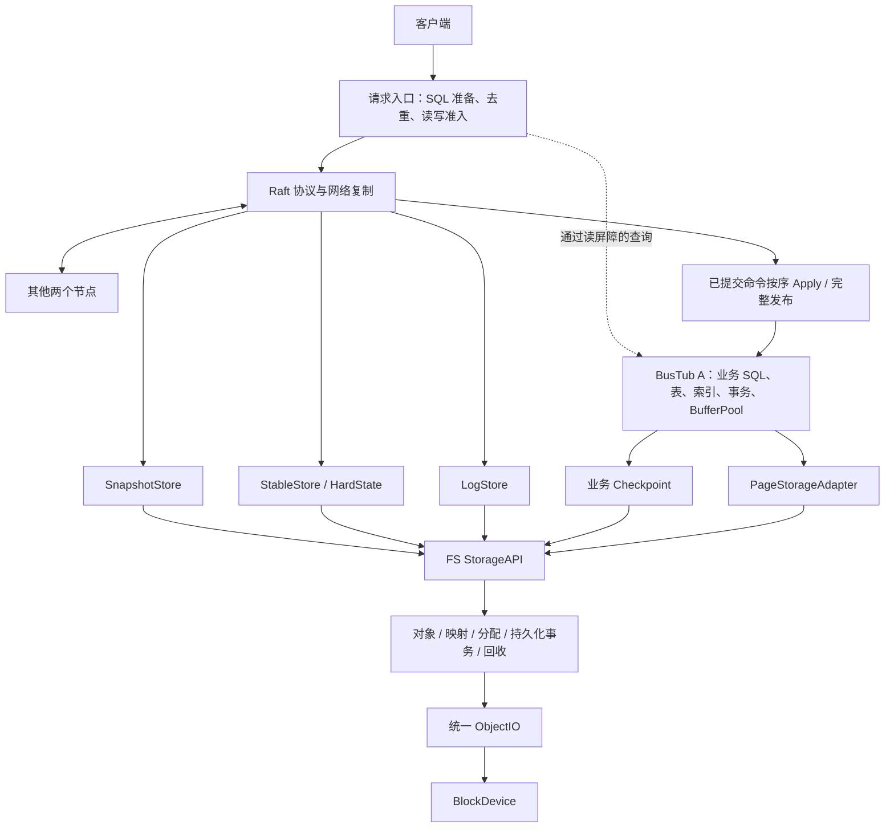
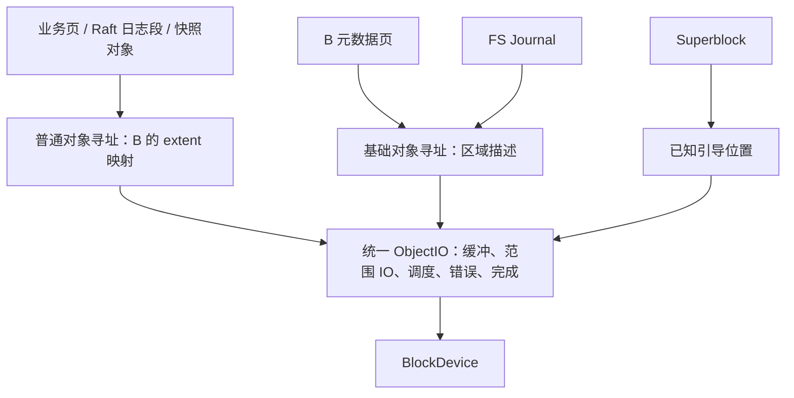

# 本地对象存储重构主方案：Raft / BusTub / FS / ObjectIO

更新时间：2026-09-20（Asia/Shanghai）

## 0. 当前状态、文档入口与工作顺序

本文件收录截至 2026-09-20 对话形成的目标架构，包含统一 ObjectIO、减少重复持久化、模块分工、实现顺序和待定项。用户认可总体方向；各子模块的详细方案、具体接口与测试仍需逐个讨论。

- 当前成果：主方案、子模块文档入口和未启用的实现 prompt 已建立。
- 当前实现状态：本轮目标架构的所有模块均为“未完成”。既有同名代码和历史 Raft 里程碑，不等于已满足本方案。
- 下一步：先讨论 [总体测试设计](testing_plan.md)，然后逐模块讨论方案、更新 prompt、按用户当轮分配实现。
- 子模块入口见第 14 节。所有模块有独立 Markdown 文件，模板见 [module_template.md](module_template.md)。
- 文档写入不授权自动实现代码、编写或运行未讨论的测试，也不授权自动推进后续模块。
- 既有未审查的性能结果不作为有效基线；测试执行方式和验收门槛留待讨论。
- 测试的已定实施约束见 [总体测试设计](testing_plan.md)；场景、预期、故障和资源的候选表见 [测试场景建议](testing_scenarios.md)。候选参数不表示已经批准执行。

历史契约阅读入口：[Raft 实施方案](../../raft_implementation_plan.md)、[执行交接](../../raft_execution_handoff.md)、[现有测试矩阵](../testing/raft_test_matrix.md)。这些文件用于了解已有正式路径、协议和历史证据。本方案的 S0–S13 是 FS 新阶段，不是历史 Raft M0–M8 的重新编号；本轮新方向不自动扩大未分配的实现任务，也不借历史验收为新代码背书。

## 1. 所有主方案、子方案与实现 prompt 必须遵守的要求

> 代码要考虑复用性，间接性，安全性，不要破坏别的模块和层次的production级代码。

> 当本次任务接续上一次任务后，需要在完成前检查之前的代码是否因为当前改动有冗余的地方，有的话可以删除，也要检查是否有根本没用到的接口或函数之类的，也需要删除。

> 测试应该保护“这个项目自己承诺的行为和风险边界”，而不是给每一层实现细节、第三方库行为和历史重构痕迹都建立一套测试。

落实要求：

- 先检查已有可复用接口、调用者和数据归属，通过明确接口隔离层次；正式代码不得反向依赖测试辅助设施。
- 清理范围是本次改动及其引起的旧路径冗余。检查虚函数、模板、注册入口和对外契约，确认无用后删除声明、实现和相关引用；不能仅因单次文本搜索没有调用就删除生产接口。
- 保留仍被现有正式路径依赖的行为，不覆盖或清理用户已有的未提交改动。
- 对每项新增、保留、修改或删除的测试，说明它保护的项目承诺或风险及验证它的边界；避免重复覆盖和自证式断言。
- 完成前报告清理结果、受影响契约与验证证据；没有可删项时记录检查范围及原因。

### 1.1 未写明的部分如何处理

> 当遇到方案中未提到的部分时，先不要自作主张去写,而是汇报当前遇到的问题（注意先不要堆砌专有词汇，用我能看的懂的话去讲当前情况，有需要时再用专有词汇）。

这条要求适用于接口、磁盘格式、兼容、失败语义、算法和测试边界等未定部分。先说明实际卡点和影响，再补必要术语。不能把猜测写成已讨论结论；与当前缺项无关且已经授权的工作可以继续。

### 1.2 子模块文档的维护方式

每个模块沿用 [prompt_1.md](../../prompt_1.md) 的组织方式：背景、目标、本阶段只做/不做、方案、失败边界、阅读/修改位置、测试、验收与输出要求。

1. 进入模块时先读主方案、该模块文件、总体测试设计及依赖模块的实际阶段状态。
2. 将讨论决定写入“讨论后的方案”，说明接口、资源和数据归属、正常/失败/恢复路径、已定与未定部分。
3. 开源参考必须同时写出来源链接、借鉴机制、原项目解决的问题、本项目的具体落点及差异。主文档列过来源，不免除子模块再次说明的责任。
4. 将通用 prompt 更新为该模块当轮可执行 prompt；未讨论部分保持待定，不能默认为可实现。
5. 实现后检查受影响旧代码的冗余、未用接口/函数和失去意义的测试，确认无用后清理。
6. 同步模块介绍、阶段表、主方案目录与完成证据。不得因建立文件、通过编译或完成部分阶段就标记整个模块完成。

### 1.3 “已完成”的含义与写法

模块完成须有：当轮约定范围的实现、约定验证的证据、受影响行为检查、冗余/未用接口清理记录及剩余限制说明。

完成后在对应模块“模块介绍与状态”的介绍文字下单独写 **“已完成”**，补上日期、代码版本、验证和清理证据；主表同步标记。跨阶段模块先更新该阶段行，完整约定范围未完成前，模块总体仍标“未完成”。

### 1.4 改造前后测试的实施约束

以下约束适用于全部子模块及其实现 prompt，详细定义和参考来源集中在 [testing_plan.md](testing_plan.md)：

1. 先审查测试内容和实现，建立旧系统基线，再做存储改造；改造后用同一套内容复测。测试内容层、测试适配层、生产层单向依赖；新旧差异收敛到测试侧适配器，不能通过适配器增加持久化、改变重试或补做业务功能。
2. 正确性验收覆盖真实客户端、三节点 Raft、BusTub、存储后端及恢复链路。输入必须有效、非空且实际产生预期读写，结果由独立预期或历史模型核对，不能只检查成功状态或进程存活。
3. 测试不得为方便自身而修改生产 API、默认路径、默认语义或增加测试专用分支。可使用已有正式配置、协议和外部进程/网络控制；能力不足时报告观察限制。架构需要的正式接口变更须在对应模块方案中另行讨论。
4. 每项性能场景有独立评价目标，同一次运行采集多项指标；不为每层重复建镜像测试。无关性能任务不能同时争抢资源；场景内计划好的并发、后台活动和事先约定的统计重复不属于重复建设。
5. 比较必须固定内容版本、数据、完成语义、重试、计时及资源口径。更换机器后重新测旧版；总内存包含相关缓存与工作缓冲，不能只对齐 BufferPool。
6. 进程终止、虚拟机重启和掉电模型分别记录。WSL/文件模拟、真实块设备和跨主机部署的结论分开；不以进程重启证明掉电安全，不以本机三个进程证明独立故障域。
7. 场景规模、机器配置、运行次数和门槛仍待讨论。测试代码及旧基线未审查前不开始 S0–S13 的生产改造；文档更新不表示测试或模块已完成。

## 2. 目标与集群边界

目标是保留当前三节点 Raft 和业务 SQL，让每个节点的本地 FS 接管对象、空间、持久化、恢复和设备 IO：

- Raft：复制历史、成员/角色、提交顺序、跨节点追赶和恢复。
- BusTub A：业务 SQL、Catalog、表、索引、事务、业务可见性及页缓存。
- 本地 FS：对象、映射、分配、提交、IO、回收与本地恢复。
- MetadataEngine B：复用 BusTub 存储组件，管理 FS 元数据。
- ObjectIO：普通数据、Raft log、snapshot、FS Journal、元数据和引导内容的统一对象范围 IO。
- BlockDevice：裸设备访问及持久化屏障；开发可提供文件模拟后端。

FS 的范围是节点内。PG、Pool、MON、CRUSH 及独立存储复制协议属于另一个架构方向，不属于本轮依赖。当前没有为三个静态节点再新增多套独立 Raft 分片。

```text
                      客户端
                         │
                    当前 Leader
                         │
         ┌───────────────┼───────────────┐
         │               │               │
       节点 1          节点 2          节点 3
         Raft ←────── Raft 复制协议 ────→ Raft
         │               │               │
      BusTub A        BusTub A        BusTub A
         │               │               │
       本地 FS         本地 FS         本地 FS
         │               │               │
       本地设备        本地设备        本地设备
```

希望改善：重复缓存与复制、设备 IO 控制、完成语义、IO 并发和空间回收。裸设备、COW、Journal 和 GC 各有成本，性能收益应在相同持久化/一致性保证下验证，不能从架构名称推定。

## 3. 单节点总体架构



业务路径：Raft → Apply → A → 页适配 → FS。Raft 自身的 LogStore、StableStore、SnapshotStore 另有直接进入 FS 的持久化路径。

节点的状态控制、资源预算与恢复编排是横切职责；它们不要求每次普通 IO 同步往返全局控制器。

## 4. 对象模型与统一 ObjectIO

### 4.1 对象归属

| 持久化内容 | 对象归属 | 寻址方式 |
| --- | --- | --- |
| A 的表页、索引页 | 普通数据库页容器对象 | B 的 extent 映射 |
| Raft entry 正文 | 普通日志段对象 | B 的 extent 映射 |
| 快照正文 | 普通不可变快照对象 | B 的 extent 映射 |
| HardState、Manifest | B 中的小控制记录，位于元数据对象 | 基础元数据寻址 |
| B 元数据页 | 基础元数据对象 | 设备区域描述 |
| FS Journal | 基础 Journal 对象/段 | 设备区域描述 |
| Superblock | 已知位置的引导对象 | 约定引导位置 |

extent 表示一段连续设备范围，如“设备 D、起点 X、长度 L”。对象逻辑上连续，物理上可以由多个 extent 组成。



### 4.2 ObjectIO 的边界

统一：请求表达、地址适配、缓冲生命周期、对齐、拆分合并、有界调度、错误结果和完成通知。普通读使用固定的已发布映射；Common 新写使用事务内预留映射。

普通对象、元数据、Journal 保留不同持久化协议。ObjectIO 执行满足前置依赖的 IO，不把 Journal 写入再次包成 Deferred。统一执行层可以有多队列、多工作线程和不同资源预算。

HardState 不必独占一个物理对象；作为 B 的小记录仍能通过元数据对象统一 IO。若将来需要对外也表现为内联对象，应在相应子方案讨论。

## 5. FS 内部职责与上下游

### 5.1 请求与对象接口

```text
StorageAPI
├── ObjectAPI：创建、读写、追加、截断、删除
├── ControlKV：少量控制记录
└── TransactionAPI：对象、控制记录及引用的原子组合
```

| 组件 | 职责 |
| --- | --- |
| Admission | 先预留数据、元数据、Journal、内存和在途 IO 资源 |
| Sequencer | 排序冲突范围及追加/截断/删除依赖，考虑实际 RMW 物理范围 |
| WritePlanner | 拆分请求，规划读旧数据、分配、校验与 Common/Deferred 路径 |
| CommitPipeline / TxContext | 薄协调器记录依赖和完成状态，装配批次；不亲自实现所有步骤 |
| VersionPublisher | 发布完整元数据/对象版本及读取来源 |
| ReadResolver | 根据可见版本生成读取计划 |

### 5.2 元数据与空间

B 管理对象属性、映射、分配事实、持久引用和控制记录。Allocator 管理普通数据空间。MetadataBackend 管理可直接寻址的元数据页区域；两者职责按地址空间区分，不能重复维护同一分配事实。

页适配采用确定性分组方向：

```text
object_id = (数据库身份, page_id / K)
offset    = (page_id % K) × page_size
```

K 尚未确定。这允许避免持久化一张可计算的 page→object 重复表。B 持久化对象逻辑范围→extent 的真正映射。

分层 bitmap：L0 保存基础分配事实，L1 以上提供全空闲/部分空闲/无空闲等搜索摘要。高层摘要尽量重建；预留与提交分开；坏块/隔离另行表达。连续空闲长度等查找信息待子方案确定。

### 5.3 持久化子系统

```text
DurabilityService（组织边界，不是额外一套日志）
├── CommitPipeline
├── JournalService
├── RecoveryDispatcher
└── 与引用、checkpoint、GC 的保留协议
```

B 提供元数据恢复记录；JournalService 统一负责 WAL/Journal 的实际记录与刷盘。RecoveryDispatcher 按类型把元数据恢复交给 B，把 Deferred 恢复交给读取/写回路径。

参考 [Ceph SeaStore](https://docs.ceph.com/en/latest/dev/crimson/seastore/) 的事务接口协调职责，用于本项目提交、日志和映射的分工；本项目继续以 B 作为元数据引擎，不照搬其完整后端和线程模型。

### 5.4 数据路径与后台工作

普通数据由写入规划得到 IO 计划，经普通对象 IO 适配、ObjectIO 访问 BlockDevice。正文不必进入 B 的普通 value 或页缓存。

ReadResolver 输出：

- 已落位范围 → 对应数据 extent。
- 尚未落位范围 → Journal 的 PayloadRef。
- 已有受保护缓冲 → 相应版本缓冲。

后台模块包括 MetadataPageWriter、B CheckpointManager、DeferredWriteback、GCService、日志段整理和校验扫描。它们共用预算并独立报告完成事件。

## 6. 持久化内容归属与去重边界

| 内容 | 正文归属 | 其他模块保存什么 |
| --- | --- | --- |
| Raft entry | 最终日志段对象 | 段位置/偏移/有效范围 |
| 快照正文 | 不可变对象 | 发布清单引用 |
| 普通业务数据 | 数据 extent | 对象映射和版本引用 |
| Deferred 正文 | Journal 记录 | PayloadRef、必要任务描述 |
| B 元数据状态 | 元数据对象 | Journal 中必要的恢复记录 |

```text
CommitBatch
├── B 元数据恢复信息
├── 控制记录变化
├── 引用建立 / 解除
├── Common 数据 durable 依赖
└── 可选 Deferred 描述与正文
```

- B WAL 与 FS Journal 共用恢复基础，不各自写一套元数据日志。
- Common 正文先写数据区域，Journal 记录必要元数据，不再复制正文。
- Deferred 的读路径、恢复与写回共用一份 Journal 正文；目录不存第二份大 value。
- Snapshot 发布通过清单引用，避免临时正文再复制到正式正文。
- 可重建索引、位图摘要、运行状态不默认独立持久化。
- 一批次是原子边界；多个批次可 group commit。LSN 递增不等于 IO 已连续 durable，不能跳过未完成空洞。
- ObjectRef / PayloadRef 需表达身份、代次、范围及完整性。持久引用变化须原子提交；临时读者和 IO 也要保护内容。
- Raft log 与 Journal 分段管理生命周期，避免长期日志拖住短周期恢复记录。

参考 [RocksDB BlobDB](https://rocksdb.org/blog/2021/05/26/integrated-blob-db.html) 的大值与索引分离，用于 B 只保存正文引用的分工；它并不承诺所有内容只写一次，本项目也不将此等同于全盘内容哈希去重。

必要的多份内容仍包括 Journal→最终位置交接、COW 旧版本、快照引用、完整页映像及三节点容错副本。Raft 命令和执行后的数据库页通常是不同表示，不能仅凭“业务内容相同”直接合并。

## 7. 写入策略与提交路径

```text
写入策略
├── Common
│   ├── 新空间写入
│   ├── COW
│   └── RMW 组装后写到安全位置
└── Deferred
    ├── 恢复记录先 durable
    └── 后台落位
```

RMW 决定如何组装完整处理单元，COW 决定是否写到新位置；二者可以结合，一个请求也可以对不同范围选择不同路径。

| 场景 | 当前默认方向 |
| --- | --- |
| 新数据、大块连续写 | Common 新空间 |
| 已有完整块覆盖 | Common COW |
| 小范围碎片更新 | RMW 后选择 COW 或 Deferred |
| 快照共享或旧版本仍有引用 | COW |
| Raft 日志追加 | Common；共享尾块修改采用尾块 COW 或已明确保护 |
| HardState 小记录 | B 的控制记录事务 |
| 适合延迟落位的小覆盖 | Deferred，受预算约束 |

具体阈值未冻结。未保护的原地覆盖不作为默认。设备对齐也不等于掉电原子性。

### 7.1 Common

```text
预留资源和新空间
 → 数据写入并 durable
 → 提交映射/分配/引用变化
 → 发布新版本
 → 返回本地提交成功
```

Common 仍需提交元数据，所以经过 CommitPipeline；正文无需提前进入 redo。

### 7.2 Deferred

```text
准备数据
 → 元数据恢复信息＋任务描述＋正文组成一个批次
 → Journal durable
 → 发布新版本（立即可从 Journal 读取）
 → 返回本地提交成功
 → 后台落位并 durable
 → 提交完成状态
 → 解除 Journal 保留
```

同范围写回维护顺序与代次；旧任务不能覆盖新版本。快照或旧读者仍保护的范围不能直接原地覆盖。恢复只能执行有效提交且适用于目标代次的任务。

参考 [BlueStore 写入策略](https://docs.ceph.com/en/latest/dev/bluestore/) 对数据先写新位置和日志保护覆盖的区分，内化为本项目两条持久化顺序；不直接套用文档中的尺寸阈值或全部实现模式。

## 8. MetadataEngine B 与引导恢复

### 8.1 复用方案

同仓库存储组件扩展，A/B 为独立运行实例，各自拥有 BufferPool、页号空间、根入口、后端和事务上下文。B 复用比较、查找、分裂、合并等基础算法，适配值表示、页格式和事务访问，不假定现有树已经是可靠的通用 KV 引擎。

必须补齐：

- 格式、页身份、代次、pageLSN、校验和树字段；新增页头同步调整节点容量。
- 避免直接沿用与现有 B+Tree 字段冲突的 LSN 偏移。
- Create/Open 分离，打开已有树不能初始化掉根入口。
- 私有修改页与原子批次，未提交页不写最终元数据位置。
- WAL 先行、重放、页分配及延迟释放。
- 元数据提交/发布基础从 S4 引入，不能等普通对象层完成后才补。

WAL 方向：checkpoint 周期首改 FULL，后续普通修改 PATCH；新页、复杂结构变化或过大增量允许 FULL。页分裂的各页、根入口和分配变化同批提交。

参考 [PostgreSQL full_page_writes](https://www.postgresql.org/docs/current/runtime-config-wal.html#GUC-FULL-PAGE-WRITES) 的完整页恢复基础，用于 B 的撕裂页保护；本项目初期采用字节后像增量和私有页约束，详细 checkpoint 首改判定仍需讨论。

### 8.2 直接寻址入口

```text
已知位置的引导对象
 → Superblock（身份、格式、代次、区域、checkpoint）
 → MetadataBackend / JournalBackend
 → 基础对象 ObjectIO

B 恢复后
 → 普通对象 extent 映射
 → 普通对象 ObjectIO
```

因此不存在“读取 B 必须先查 B 保存的普通映射”的循环。上述基础后端承担 BlueFS 类似的底层支撑职责；B 采用页接口，不要求完整 POSIX 文件语义。

### 8.3 元数据 checkpoint

首版方向：

```text
暂停接纳 B 新修改
 → 排空已接纳批次并确定边界
 → 写回已提交元数据页并 durable
 → 可靠发布 checkpoint
 → 开启新周期
```

裁剪还须确认 Deferred 和其他引用已解除。某一页曾写回一次，不代表其 FULL 恢复基础可以立即删除。更细并发 checkpoint 不是隐含的第一阶段要求。

## 9. Raft Store、业务库 A 与恢复点

### 9.1 LogStore

- 内存索引：index→segment/offset/length。
- Active segment 追加，达到目标大小后轮转为 Sealed segment。
- Manifest 保存有效段、有效范围和代次。
- Append、未提交后缀替换、安全前缀截断、追赶读取保留 Raft 语义。
- 正文直接写日志段对象；恢复不接受未发布的旧尾部。
- 整理是有效 entry 搬迁，不擅自合并业务命令。

参考 [TiKV Raft Engine](https://github.com/tikv/raft-engine#design) 的追加段、内存位置索引与协作 GC，内化到 F23/F29；不因此为当前集群新增多套 Raft 分片。

### 9.2 StableStore

保留 current_term、voted_for、commit_index 等当前项目约定。上层判断单调性与投票规则，ControlKV/B 提供本地持久化。依赖 term/vote 的消息仍遵守持久化先行关系。格式兼容或迁移需要单独讨论。

### 9.3 SnapshotStore

创建/接收不可变正文对象，完成持久化和校验后发布 Manifest；管理保留版本、传输引用、分块及回收。第一阶段发布不复制正文，后续再讨论共享、压缩和增量传输。

参考 [Btrfs reflink](https://btrfs.readthedocs.io/en/stable/Glossary.html#term-reflink) 的共享 extent 与修改时 COW，用于本项目版本共享。当前 canonical 快照与物理数据库页格式不同，不能自动获得页共享或增量快照。

### 9.4 A 页适配与业务恢复

A 保留 SQL、Catalog、表、索引、事务和 BufferPool。页适配处理对象范围、错误传播、页版本、在途缓冲及释放请求；页 IO 并发还需要解除现有上层持锁等待等限制。

接入初期沿用“已验证快照＋已提交 Raft 日志”重建业务状态。后续目标为“可靠本地业务 checkpoint C＋C 之后已提交日志”。

业务恢复点必须一致捕获表、索引、Catalog、会话去重、分配状态、applied index 及对应对象版本/映射根。单独持久化 applied index 不代表业务页可恢复。只有该恢复链成立，才能依赖 Raft 日志而不再为 A 默认增加另一套业务 WAL。

B checkpoint 恢复本地元数据；A checkpoint/快照恢复业务状态，不能混用。索引物理保存还是重建、业务暂停边界及现有格式兼容，留给 F28 讨论。

## 10. GC、缓存、资源和状态

### 10.1 回收

```text
所有者判断内容无用
 → 向 GCService 提交有类型的请求
 → 持久化解除逻辑引用
 → 等待旧版本/读者/在途 IO
 → 允许物理复用
```

A 判断 tuple/undo/页存活性；Raft/LogStore 判断日志截断；SnapshotStore 判断保留/传输引用；B/checkpoint 判断恢复记录依赖；FS 引用管理判断 extent 引用。

GCService 统一预算和执行安排，不拿一个混合事务时间戳、Raft index、Journal LSN 的全局最小值代替各模块判断。基础 COW 回收随 S7 实现；A 先清理页链、索引和事务引用，再请求整页释放。

### 10.2 缓存

| 内容 | 主要位置 |
| --- | --- |
| 业务页 | A BufferPool |
| 元数据页 | B BufferPool |
| 解码映射 | FS 元数据缓存 |
| RMW / Deferred / 在途 IO | 有界工作缓冲或 Journal |
| 日志尾部 | 有限追加缓冲 |
| 快照 | 流式缓冲与有限预读 |

默认不再建设通用的 FS 干净业务页缓存。不冻结 70/30，先保留工作内存和前进所需资源，再讨论可淘汰缓存比例。直接设备 IO 还需要合适后端与对齐策略，裸设备不自动消除所有内存复制。

### 10.3 状态视图

```text
模块事实 → NodeStateController → 完整 NodeView / 必要异步动作
```

- phase：Starting / Recovering / Serving / Draining / Stopped / Failed。
- conditions：SpacePressure / ReadOnly / IOFault / ReplicaLag 等可叠加事实。
- capabilities：业务写、线性一致读、接收复制、后台恢复等按操作划分。

主原因按优先级展示；权限综合所有相关条件。严重错误发生处先限制操作，再汇报。普通 IO 不逐次等待全局命令；控制器不持锁等待；动作带代次，必须有完成确认才能报告已停止/已恢复。

参考 [Kubernetes Node Status](https://kubernetes.io/docs/reference/node/node-status/) 的并存 Conditions，内化为 F33 的状态表示；节点内原子视图和动作协议由本项目定义，不把它当成现成全局状态机。

## 11. 并发、Raft 一致性和错误边界

- 有界队列承接请求，多请求规划、无冲突数据 IO 与前后台工作可以重叠。
- 元数据初期可有单写入执行角色，配合批量提交；不意味着全部数据 IO 串行。
- TxContext 保留逻辑依赖，线程可执行其他工作；不持全局锁等待 IO。
- 物理完成乱序不能破坏逻辑可见顺序或 durable 连续边界。
- 客户端成功要求 Raft 提交、按序 Apply 和完整业务发布。
- 线性一致读取得安全 ReadIndex 后等待已发布应用位置满足要求；不能把正常 Apply 落后当成可读旧值的理由。
- 多提案还要处理旧值/版本前置条件、请求身份、去重与冲突，不能只去掉单提案限制。
- 当前“每客户端只保留最后结果”和“Leader 全局仅一个未完成新写提案”是两个独立限制，两项改进统一纳入 F35 / S13。全局多提案细化原有流水线目标，单客户端多请求及多结果窗口补足原有去重要求；不新增同职责模块或 S14。归属、协作边界见 [F35 §2.1](modules/raft-pipeline.md#21-唯一归属与协作边界)，候选方案及开源参考见该文档第 4–5 节。详细设计待讨论；不得为压测提前改变旧版语义。
- 结果不确定时不得盲目当作未提交重用序号或返回普通业务拒绝；具体处置在相应模块讨论。

参考 [etcd/raft](https://github.com/etcd-io/raft/blob/main/README.md) 的协议决策与外部执行分离，内化为 F35 的持久化、消息和 Apply 依赖；本项目业务准备/可见性仍需单独设计。

## 12. 节点启动与关闭

```text
打开设备
 → 建立基础 ObjectIO
 → 读取有效 Superblock
 → 定位元数据和 Journal 基础对象
 → 恢复 B checkpoint 与 Journal
 → 重建普通映射、分配摘要、Deferred 可读来源
 → 开放满足条件的 StorageAPI
 → 打开 Raft 三种 Store
 → 恢复 A
 → 按 Raft 协议开放相应能力
```

不必一律等所有 Deferred 落位，但必须先有正确读取来源、保留和写入依赖。关闭时先限制新请求，再按约定排空或保留可恢复工作；发出停止命令不等于停止完成。具体停机与恢复失败策略归 F34 讨论。

## 13. 先测试设计，再逐阶段实现

**T0：先完成改造前后的正确性与性能测试设计。** [testing_plan.md](testing_plan.md) 记录已定约束与待定项，[testing_scenarios.md](testing_scenarios.md) 给出待审查候选表。顺序为：讨论场景与资源 → 审查测试实现 → 运行并记录旧系统基线 → 逐模块改造 → 用冻结的测试内容复测。当前没有批准具体执行命令、阈值或性能结论；模块新风险所需的必要测试随模块方案补齐。

| 顺序 | 模块方案所在文档 | 阶段目标 | 是否完成 |
| --- | --- | --- | --- |
| S0 | [F00 存储契约与共享类型](modules/storage-contracts.md) | 明确共享契约、对象身份、原子边界、完成与错误语义。 | 未完成 |
| S1 | [F01 BlockDevice](modules/block-device.md)<br>[F02 统一 ObjectIO 与 IO 执行器](modules/object-io.md)<br>[F31 资源预算与背压基础](modules/resource-budget.md)<br>[F32 缓存职责与内存策略](modules/cache-policy.md)<br>[F33 NodeStateController](modules/node-state-controller.md) | 建立设备与有界 IO 基础、缓冲所有权、资源记账及最小生命周期/错误状态。 | 未完成 |
| S2 | [F03 Superblock 与引导对象](modules/bootstrap.md)<br>[F04 RegionManager](modules/region-manager.md)<br>[F05 MetadataBackend](modules/metadata-backend.md)<br>[F06 JournalBackend](modules/journal-backend.md)<br>[F02 统一 ObjectIO 与 IO 执行器](modules/object-io.md)<br>[F34 节点启动、恢复与关闭编排](modules/node-lifecycle.md) | 基础对象与已知引导位置可访问；区域和直接页/Journal 后端可定位。 | 未完成 |
| S3 | [F31 资源预算与背压基础](modules/resource-budget.md)<br>[F16 Admission](modules/admission.md)<br>[F07 JournalService](modules/journal-service.md) | Journal 有界准入、原子记录编码、批量刷盘、读取与有效边界扫描。 | 未完成 |
| S4 | [F16 Admission](modules/admission.md)<br>[F17 Sequencer](modules/sequencer.md)<br>[F19 CommitPipeline 与 TxContext](modules/commit-pipeline.md)<br>[F20 VersionPublisher](modules/version-publisher.md)<br>[F08 MetadataEngine B](modules/metadata-engine.md)<br>[F05 MetadataBackend](modules/metadata-backend.md)<br>[F07 JournalService](modules/journal-service.md)<br>[F32 缓存职责与内存策略](modules/cache-policy.md) | 先补 B 所需排序、元数据批次提交和发布，再完成 B 私有页、页格式、FULL/PATCH 与树适配。 | 未完成 |
| S5 | [F09 MetadataPageWriter](modules/metadata-page-writer.md)<br>[F10 B CheckpointManager](modules/metadata-checkpoint.md)<br>[F11 RecoveryDispatcher](modules/recovery-dispatcher.md)<br>[F34 节点启动、恢复与关闭编排](modules/node-lifecycle.md)<br>[F33 NodeStateController](modules/node-state-controller.md) | B 页写回、checkpoint、恢复分发和启动恢复闭环。 | 未完成 |
| S6 | [F12 Allocator](modules/allocator.md)<br>[F13 对象元数据与 extent 映射](modules/object-mapping.md)<br>[F14 内容引用与保留管理](modules/reference-manager.md)<br>[F02 统一 ObjectIO 与 IO 执行器](modules/object-io.md) | 普通对象的分配、映射、引用和寻址进入统一 ObjectIO。 | 未完成 |
| S7 | [F15 StorageAPI](modules/storage-api.md)<br>[F16 Admission](modules/admission.md)<br>[F17 Sequencer](modules/sequencer.md)<br>[F18 WritePlanner 与路径选择](modules/write-planner.md)<br>[F19 CommitPipeline 与 TxContext](modules/commit-pipeline.md)<br>[F20 VersionPublisher](modules/version-publisher.md)<br>[F21 ReadResolver](modules/read-resolver.md)<br>[F22 GCService](modules/gc-service.md)<br>[F31 资源预算与背压基础](modules/resource-budget.md) | 对象创建/读写/删除、Common、原子发布及基础回收形成可恢复闭环。 | 未完成 |
| S8 | [F23 LogStore](modules/raft-log-store.md)<br>[F24 StableStore / HardState](modules/raft-stable-store.md)<br>[F25 SnapshotStore](modules/snapshot-store.md)<br>[F34 节点启动、恢复与关闭编排](modules/node-lifecycle.md)<br>[F33 NodeStateController](modules/node-state-controller.md) | 接入 Raft 日志段、HardState 控制记录和快照引用发布，保留协议与恢复约束。 | 未完成 |
| S9 | [F26 BusTub A 页适配与页 IO 接入](modules/page-storage-adapter.md)<br>[F32 缓存职责与内存策略](modules/cache-policy.md)<br>[F34 节点启动、恢复与关闭编排](modules/node-lifecycle.md) | 业务页接入 FS，处理错误传播、页版本、IO 等待与整页释放。 | 未完成 |
| S10 | [F27 DeferredWriteback 与待落位索引](modules/deferred-writeback.md)<br>[F07 JournalService](modules/journal-service.md)<br>[F10 B CheckpointManager](modules/metadata-checkpoint.md)<br>[F11 RecoveryDispatcher](modules/recovery-dispatcher.md)<br>[F14 内容引用与保留管理](modules/reference-manager.md)<br>[F16 Admission](modules/admission.md)<br>[F17 Sequencer](modules/sequencer.md)<br>[F18 WritePlanner 与路径选择](modules/write-planner.md)<br>[F19 CommitPipeline 与 TxContext](modules/commit-pipeline.md)<br>[F20 VersionPublisher](modules/version-publisher.md)<br>[F21 ReadResolver](modules/read-resolver.md)<br>[F22 GCService](modules/gc-service.md)<br>[F31 资源预算与背压基础](modules/resource-budget.md)<br>[F33 NodeStateController](modules/node-state-controller.md)<br>[F34 节点启动、恢复与关闭编排](modules/node-lifecycle.md) | Deferred 从提交后可读到有序落位及安全裁剪的完整路径。 | 未完成 |
| S11 | [F28 BusTub A 业务 Checkpoint](modules/business-checkpoint.md)<br>[F13 对象元数据与 extent 映射](modules/object-mapping.md)<br>[F14 内容引用与保留管理](modules/reference-manager.md)<br>[F25 SnapshotStore](modules/snapshot-store.md)<br>[F22 GCService](modules/gc-service.md)<br>[F34 节点启动、恢复与关闭编排](modules/node-lifecycle.md) | 可靠业务恢复点、固定对象版本与共享快照，具体共享/压缩/增量范围再讨论。 | 未完成 |
| S12 | [F22 GCService](modules/gc-service.md)<br>[F29 日志段整理](modules/log-segment-cleaner.md)<br>[F30 校验扫描与损坏上报](modules/integrity-scrubber.md)<br>[F31 资源预算与背压基础](modules/resource-budget.md)<br>[F32 缓存职责与内存策略](modules/cache-policy.md)<br>[F33 NodeStateController](modules/node-state-controller.md) | 完整回收、日志整理、校验扫描和前后台资源协调。 | 未完成 |
| S13 | [F35 Raft 提案流水线与线性一致读](modules/raft-pipeline.md)<br>[F02 统一 ObjectIO 与 IO 执行器](modules/object-io.md)<br>[F18 WritePlanner 与路径选择](modules/write-planner.md)<br>[F31 资源预算与背压基础](modules/resource-budget.md)<br>[F32 缓存职责与内存策略](modules/cache-policy.md) | F35 内先明确业务依赖，再推进多客户端有界提案，随后扩展单客户端请求/结果窗口及恢复兼容；保留读屏障，并进行已约定的 IO/策略调优。 | 未完成 |

阶段表是依赖顺序，不表示每个模块只在该阶段出现一次。特别是 B 在 S4 已需要准入、排序、提交和发布的最小能力；S7 扩展同一套组件服务普通对象，S10 再扩展 Deferred，不建立第二套同职责实现。F02 先基础对象，再普通对象；F33/F34 的生命周期支持从早期持续完善。

本阶段只能实现用户当轮已分配的范围。未定义的参数、接口与失败分支按第 1.1 节处理。

## 14. 模块目录与完成状态

每行文档包含职责、阶段、依赖、开源参考、本地落点、待讨论项、详细方案位置、测试约束、未启用 prompt 和完成证据栏。

| 模块与专用方案文档 | 阶段 | 模块介绍 | 是否完成 |
| --- | --- | --- | --- |
| [F00 存储契约与共享类型](modules/storage-contracts.md) | S0 | 明确对象、引用、完成语义、原子边界和各模块的数据归属。 | 未完成 |
| [F01 BlockDevice](modules/block-device.md) | S1 | 提供设备读写、能力查询、持久化屏障和真实错误结果。 | 未完成 |
| [F02 统一 ObjectIO 与 IO 执行器](modules/object-io.md) | S1、S2、S6、S13 | 让普通、基础和引导对象共用范围 IO、缓冲生命周期、调度与错误传播。 | 未完成 |
| [F03 Superblock 与引导对象](modules/bootstrap.md) | S2 | 通过已知设备位置定位格式、设备身份、区域和恢复入口。 | 未完成 |
| [F04 RegionManager](modules/region-manager.md) | S2 | 管理元数据、Journal 与普通数据区域的边界和寻址描述。 | 未完成 |
| [F05 MetadataBackend](modules/metadata-backend.md) | S2、S4 | 把 B 的元数据页号转换为基础对象范围，并承接该区域的页空间管理。 | 未完成 |
| [F06 JournalBackend](modules/journal-backend.md) | S2 | 提供可直接寻址的基础 Journal 对象与段访问。 | 未完成 |
| [F07 JournalService](modules/journal-service.md) | S3、S4、S10 | 统一承担 B WAL 与 FS 恢复记录的编码、追加、刷盘、读取和扫描。 | 未完成 |
| [F08 MetadataEngine B](modules/metadata-engine.md) | S4 | 复用 BusTub 存储算法，建立独立运行上下文的可恢复元数据引擎。 | 未完成 |
| [F09 MetadataPageWriter](modules/metadata-page-writer.md) | S5 | 将 B 已提交且满足 WAL 先行条件的页面写回元数据对象。 | 未完成 |
| [F10 B CheckpointManager](modules/metadata-checkpoint.md) | S5、S10 | 建立本地元数据恢复边界并协调 Journal 保留。 | 未完成 |
| [F11 RecoveryDispatcher](modules/recovery-dispatcher.md) | S5、S10 | 将有效提交批次中的恢复信息交给对应消费者。 | 未完成 |
| [F12 Allocator](modules/allocator.md) | S6 | 管理普通数据空间的查找、预留、分配和释放。 | 未完成 |
| [F13 对象元数据与 extent 映射](modules/object-mapping.md) | S6、S11 | 将对象身份、版本和逻辑范围映射到物理 extent。 | 未完成 |
| [F14 内容引用与保留管理](modules/reference-manager.md) | S6、S10、S11 | 管理正文的一份归属、多方引用和安全回收条件。 | 未完成 |
| [F15 StorageAPI](modules/storage-api.md) | S7 | 对上层提供对象操作、少量控制记录和组合事务接口。 | 未完成 |
| [F16 Admission](modules/admission.md) | S3、S4、S7、S10 | 在执行前预留请求需要的资源，并提供限流与背压。 | 未完成 |
| [F17 Sequencer](modules/sequencer.md) | S4、S7、S10 | 维护修改依赖，从元数据写入顺序扩展到对象范围和写回范围。 | 未完成 |
| [F18 WritePlanner 与路径选择](modules/write-planner.md) | S7、S10、S13 | 拆分写请求，规划分配、读旧数据、校验及 Common/Deferred 路径。 | 未完成 |
| [F19 CommitPipeline 与 TxContext](modules/commit-pipeline.md) | S4、S7、S10 | 以薄协调器组织批次、依赖和完成事件，统一持久化事务。 | 未完成 |
| [F20 VersionPublisher](modules/version-publisher.md) | S4、S7、S10 | 发布完整的已提交元数据或对象版本及其读取来源。 | 未完成 |
| [F21 ReadResolver](modules/read-resolver.md) | S7、S10 | 为可见对象版本生成读取计划，并拼接正确的数据范围。 | 未完成 |
| [F22 GCService](modules/gc-service.md) | S7、S10、S11、S12 | 统一接收各模块的回收请求、安排执行与资源预算。 | 未完成 |
| [F23 LogStore](modules/raft-log-store.md) | S8 | 将现有 Raft 日志语义适配到最终日志段对象。 | 未完成 |
| [F24 StableStore / HardState](modules/raft-stable-store.md) | S8 | 保留 term、vote、commit 的协议约束，将正文存入 B 控制记录。 | 未完成 |
| [F25 SnapshotStore](modules/snapshot-store.md) | S8、S11 | 管理不可变快照正文、清单发布、接收传输与保留。 | 未完成 |
| [F26 BusTub A 页适配与页 IO 接入](modules/page-storage-adapter.md) | S9 | 让业务页保持页语义，经对象范围接口访问 FS。 | 未完成 |
| [F27 DeferredWriteback 与待落位索引](modules/deferred-writeback.md) | S10 | 消费已提交恢复正文并安全写入最终位置。 | 未完成 |
| [F28 BusTub A 业务 Checkpoint](modules/business-checkpoint.md) | S11 | 建立能与 Raft 日志尾部组成完整业务恢复链的本地恢复点。 | 未完成 |
| [F29 日志段整理](modules/log-segment-cleaner.md) | S12 | 整理部分有效的 Raft 日志段，并原子替换有效段清单。 | 未完成 |
| [F30 校验扫描与损坏上报](modules/integrity-scrubber.md) | S12 | 按约定范围检查对象与元数据完整性，反馈可解释的错误。 | 未完成 |
| [F31 资源预算与背压基础](modules/resource-budget.md) | S1、S3、S7、S10、S12、S13 | 统一记账内存、在途 IO、Journal、元数据空间和后台保留。 | 未完成 |
| [F32 缓存职责与内存策略](modules/cache-policy.md) | S1、S4、S9、S12、S13 | 划清 A 页缓存、B 页缓存、解码元数据及工作缓冲职责。 | 未完成 |
| [F33 NodeStateController](modules/node-state-controller.md) | S1、S5、S8、S10、S12 | 将模块事实汇总为节点阶段、可叠加条件与操作能力。 | 未完成 |
| [F34 节点启动、恢复与关闭编排](modules/node-lifecycle.md) | S2、S5、S8、S9、S10、S11 | 按依赖打开设备、B、Store、业务状态，并正确关闭入口和排空工作。 | 未完成 |
| [F35 Raft 提案流水线与线性一致读](modules/raft-pipeline.md) | S13 | 负责全局有界多提案、业务依赖与线性一致读，以及单客户端多请求、结果保留和安全重试/回收。 | 未完成 |

以下是组合名称或内部结构，而非第二个实现所有者：

- DurabilityService：F19/F07/F11 及保留协议的组织边界。
- TxContext：F19 内部请求上下文。
- 普通数据 IO 适配 / IOExecutor：F02 的统一执行与寻址适配职责。
- ControlKV：F15 对外接口，由 F08 的小控制记录实现。
- 待落位索引：F27 的执行状态，与 F21/F14 协作。
- ApplyExecutor / 业务可见性：现有业务正式路径，适配和并发调整归 F26/F35。
- 客户端请求窗口 / SessionTable 演进：F35 内部职责；会话语义由 F35 定义，F25/F28 协作保存其恢复状态，不另建一套会话持久化服务。F35 业务流水线与 F19 本地存储事务流水线分属不同层次。
- 业务 SQL/Catalog/表/索引：沿用 A；相关恢复点归 F28，不能以本次重构默认重写业务层。

## 15. 待定参数、测试讨论和长期限制

尚未冻结：

1. 对象打包页数 K、日志段与 Journal 段目标大小。
2. 元数据和 Journal 容量、扩展、空闲与紧急预留。
3. 设备对齐、最小分配、校验单位；这些单位不必相同。
4. 完整页/增量编码、记录上限、磁盘格式、版本与兼容方案。
5. Common/Deferred 阈值和可安全覆盖的条件。
6. checkpoint 周期、并发方式和恢复时间目标。
7. 缓存比例、在途 IO、批次、后台 GC 和写回预算。
8. 快照共享格式、压缩与增量传输范围。
9. 结果不确定、损坏、IO 故障及服务降级的具体边界。
10. 完整测试代码、故障模型、独立判定依据和同保证下的新旧性能基线。

讨论过的测试方向包括吞吐、尾延迟、写/读/网络放大、内存/设备饱和度、恢复时间、空间稳定性及后台干扰；它们当前只是方向，不是已通过或已批准的测试。

已有未审查的结果不作为基线。测试应说明承诺、风险、观察边界与独立判定依据，避免镜像每层实现细节、测第三方保证或保留历史重构痕迹。具体记录见测试文档。

## 16. 文档变更记录

- 2026-09-20：明确全局单提案及单客户端单结果两项改进归 F35 / S13，区分原有目标与补充目标，并补齐内部实施顺序和跨模块协作边界；无新增模块或生产实现。
- 2026-09-20：补充改造前后测试的三层隔离、真实 E2E、禁止测试侵入生产、场景去重、同条件比较和故障证据边界；增加候选场景表与课程测试、etcd、Ceph 等参考落点。仅更新文档，未编写或运行测试，未认可旧测量。
- 2026-09-20：根据本次对话建立完整主方案、36 个独立模块入口、测试讨论入口和 prompt 模板。
- 本次只落文档，未实现 FS 模块，未编写或运行系统测试，未把既有未审查测量升级为有效基线。
- 后续每次讨论和实现都更新对应模块及主表；完成标记必须附代码、验证和清理证据。
